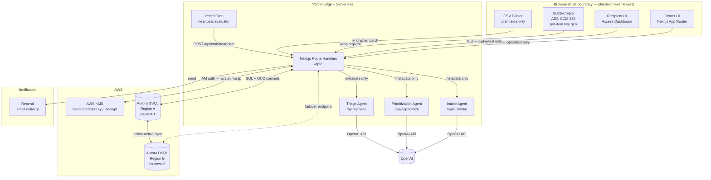
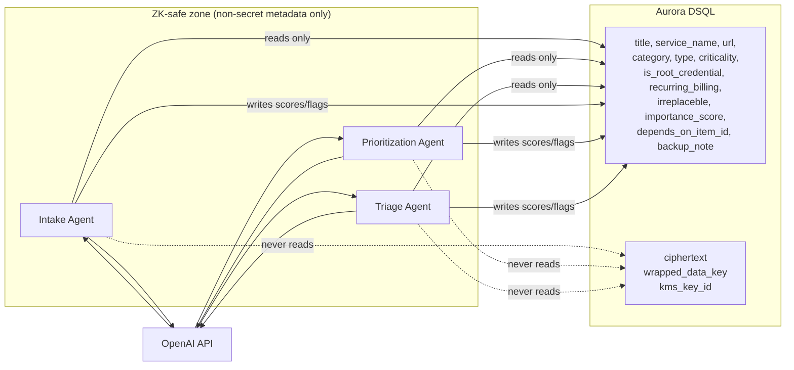
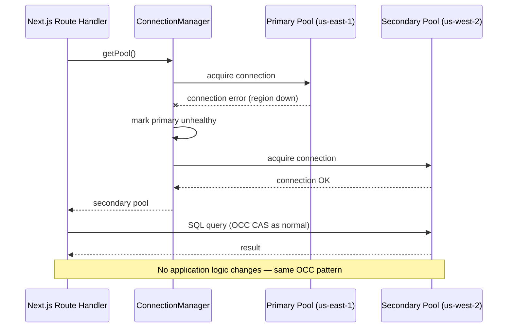

# Design Document — Relay H0 MVP

## Overview

Relay is a living-continuity platform. Owners build an encrypted vault of accounts, credentials, documents, and instructions, assign scoped access to recipients, and configure verified trigger conditions. When a trigger fires the system advances through a controlled release state machine (ARMED → PENDING → GRACE → RELEASED) guarded by optimistic concurrency control. Emergencies are reversible; estate handoffs are permanent.

The MVP targets the H0 hackathon with four demo moments:
1. Reversible emergency flow end-to-end
2. Live region failover (Aurora DSQL active-active)
3. OCC correctness — can never double-release
4. Importance moment — risk graph reveal ("this email gates 40 resets")

**Stack locked:** Next.js 14 App Router on Vercel · Aurora DSQL (two regions) · AWS KMS (client-side envelope encryption) · Vercel Cron · OpenAI serverless functions · Resend email.

---

## Architecture

### System Architecture Diagram



The `DSQL_A <--> DSQL_B` link is the headline. Aurora DSQL maintains both regional endpoints as active-active with strong consistency. For the demo, Region A's endpoint is disabled mid-flow; all traffic routes to Region B transparently.

### Two Emotional Modes

Relay renders two visually distinct modes driven by the authenticated role and release state:

| Mode | Trigger condition | Palette | Typography | Density |
|---|---|---|---|---|
| **Owner mode** | Owner session, any release state | Blue/neutral, low saturation | Regular weight, 14–16 px body | Information-dense, sidebar nav |
| **Access mode** | Recipient session, state = RELEASED | Warm amber accent, white bg | Bold, 18–20 px body, generous leading | Minimal chrome, full-width steps |

The transition is a full Next.js layout swap (`/access/*` routes use `AccessLayout`; all others use `OwnerLayout`).

---

## Components and Interfaces

### 1. Next.js App Router — Route Structure

```
app/
  (owner)/
    layout.tsx              # OwnerLayout — calm Owner mode
    onboarding/page.tsx     # Step-by-step vault setup
    vault/page.tsx          # Dashboard — items by category/criticality
    vault/[id]/page.tsx     # Item detail + edit
    import/page.tsx         # CSV import + Completeness nudges
    recipients/page.tsx     # Recipient + verifier management
    rules/page.tsx          # Access rule builder
    triggers/page.tsx       # Cadence + trigger type config + Simulate
    audit/page.tsx          # Hash-chained audit log viewer
  (access)/
    layout.tsx              # AccessLayout — focused Access mode
    access/page.tsx         # Recipient dashboard — importance-ordered plan
    access/[itemId]/page.tsx # Item decrypt + display
  api/
    vault/items/route.ts          # GET list, POST create
    vault/items/[id]/route.ts     # GET, PUT, DELETE
    vault/items/[id]/decrypt/route.ts # POST — KMS unwrap + serve ciphertext
    import/route.ts               # POST — batch ciphertext upload
    recipients/route.ts           # GET, POST
    recipients/[id]/route.ts      # PUT, DELETE
    verifiers/route.ts            # GET, POST
    verifiers/[id]/route.ts       # PUT, DELETE
    rules/route.ts                # GET, POST
    rules/[id]/route.ts           # PUT, DELETE
    checkin/route.ts              # PUT — owner heartbeat
    triggers/[type]/initiate/route.ts  # POST — manual emergency
    triggers/[id]/confirm/route.ts     # POST — verifier confirmation
    triggers/[id]/cancel/route.ts      # POST — owner cancel (reversible)
    access/route.ts               # GET — recipient scoped items (post-RELEASED)
    access/[itemId]/decrypt/route.ts   # POST — recipient decrypt
    audit/route.ts                # GET — hash-chained log
    kms/wrap/route.ts             # POST — KMS proxy: GenerateDataKey
    kms/unwrap/route.ts           # POST — KMS proxy: Decrypt (auth-gated)
    ai/intake/route.ts            # POST — metadata → scores/flags
    ai/prioritize/route.ts        # POST — gap detection
    ai/triage/route.ts            # POST — handoff plan generation
    cron/heartbeat/route.ts       # POST — Vercel Cron handler
    demo/simulate/route.ts        # POST — demo fast-forward (flagged accounts only)
```

### 2. Crypto Boundary

Two actors:
- **Browser (`CryptoService`)** — uses `window.crypto.subtle` (SubtleCrypto). Generates per-item AES-GCM-256 key, encrypts payload, calls `/api/kms/wrap` for the wrapped key.
- **Backend KMS proxy (`/api/kms/*`)** — thin route handler authenticated via Next-Auth session. Forwards `GenerateDataKey` / `Decrypt` to AWS KMS over IAM; never logs or returns the plaintext data key.

The crypto boundary is enforced by interface, not by trust: the backend never receives plaintext because the browser encrypts before calling the API.

### 3. Release State Machine

A single `release_state` row per `(owner_id, trigger_type)`. All mutations go through the `ReleaseStateMachine` service class in `lib/release/state-machine.ts`. This class encapsulates the CAS UPDATE, retry logic, and audit write.

### 4. AI Agents — ZK Boundary

All three agents (`IntakeAgent`, `PrioritizationAgent`, `TriageAgent`) are Next.js route handlers that call the OpenAI API. The ZK boundary is enforced at the query layer: the data access layer for AI routes filters `ciphertext` and `wrapped_data_key` columns before returning rows. The Intake Agent's IAM role is explicitly excluded from `kms:Decrypt` in the KMS key policy.

```
AI Route Handler
  ├── reads vault_items WHERE owner_id = :oid
  │   SELECT id, title, service_name, url, category, type, criticality,
  │          is_root_credential, recurring_billing, irreplaceable,
  │          importance_score, depends_on_item_id, backup_note
  │   -- NO: ciphertext, wrapped_data_key, kms_key_id
  └── sends metadata → OpenAI → writes scores/flags back to vault_items
```

### 5. Vercel Cron Scheduler

`vercel.json` configures `/api/cron/heartbeat` to run every 30 minutes (safely under the 1-hour requirement). The handler reads all active owners, evaluates each `last_active_at` vs `checkin_interval_days`, and invokes the `ReleaseStateMachine` for any owners past their window. Retry uses exponential backoff (base 5 s, max 3 retries) per owner before logging and moving on.

### 6. Multi-Region Connection Manager

`lib/db/connection.ts` maintains two `pg.Pool` instances — one per DSQL regional endpoint. The active pool is selected via an environment variable (`DSQL_PRIMARY_ENDPOINT`, `DSQL_SECONDARY_ENDPOINT`). For the demo failover: setting `DSQL_USE_SECONDARY=true` rotates all queries to the secondary pool. Production path: health-check on each request; rotate on connection error.

```typescript
export function getPool(): pg.Pool {
  if (process.env.DSQL_USE_SECONDARY === 'true' || primaryPool.totalCount === 0) {
    return secondaryPool;
  }
  return primaryPool;
}
```

---

## Data Models

### Full Schema (DSQL-Correct DDL)

```sql
-- ============================================================
-- DSQL notes:
--   • No FK constraints enforced by the DB — all referential
--     integrity is enforced in application logic.
--   • OCC: snapshot isolation; conflicting commits → SQLSTATE 40001.
--   • Indexes: key-ordered; covering columns aid single-owner scans.
--   • UUID PKs: gen_random_uuid() for distribution across nodes.
-- ============================================================

CREATE TABLE users (
  id                   UUID        PRIMARY KEY DEFAULT gen_random_uuid(),
  email                TEXT        NOT NULL,
  auth_sub             TEXT        NOT NULL,        -- OAuth/Clerk subject
  status               TEXT        NOT NULL DEFAULT 'active', -- active|suspended
  last_active_at       TIMESTAMPTZ NOT NULL DEFAULT now(),
  checkin_interval_days INT        NOT NULL DEFAULT 30
                                   CHECK (checkin_interval_days BETWEEN 1 AND 365),
  is_demo_account      BOOLEAN     NOT NULL DEFAULT false,
  created_at           TIMESTAMPTZ NOT NULL DEFAULT now()
);
CREATE INDEX idx_users_auth_sub ON users (auth_sub);
CREATE INDEX idx_users_email    ON users (email);

CREATE TABLE recipients (
  id           UUID        PRIMARY KEY DEFAULT gen_random_uuid(),
  owner_id     UUID        NOT NULL,   -- app-enforced ref to users.id
  name         TEXT        NOT NULL,
  relationship TEXT,
  email        TEXT        NOT NULL,
  phone        TEXT,
  role         TEXT        NOT NULL    -- recipient|executor|caregiver|partner
                           CHECK (role IN ('recipient','executor','caregiver','partner')),
  created_at   TIMESTAMPTZ NOT NULL DEFAULT now()
);
CREATE INDEX idx_recipients_owner ON recipients (owner_id);

CREATE TABLE verifiers (
  id                  UUID        PRIMARY KEY DEFAULT gen_random_uuid(),
  owner_id            UUID        NOT NULL,
  name                TEXT        NOT NULL,
  email               TEXT        NOT NULL,
  phone               TEXT,
  verification_status TEXT        NOT NULL DEFAULT 'pending',
  created_at          TIMESTAMPTZ NOT NULL DEFAULT now()
);
CREATE INDEX idx_verifiers_owner ON verifiers (owner_id);

CREATE TABLE vault_items (
  id                  UUID        PRIMARY KEY DEFAULT gen_random_uuid(),
  owner_id            UUID        NOT NULL,
  type                TEXT        NOT NULL
                      CHECK (type IN ('login','account','document','note','instruction')),
  title               TEXT        NOT NULL
                      CHECK (char_length(title) BETWEEN 1 AND 200),
  service_name        TEXT,
  url                 TEXT        CHECK (char_length(url) <= 2048),
  category            TEXT
                      CHECK (category IN ('finance','health','government','utilities',
                                          'communication','professional','personal','other')),
  criticality         TEXT
                      CHECK (criticality IN ('critical','high','medium','low')),
  -- importance engine flags (non-secret; ZK-preserving)
  is_root_credential  BOOLEAN     NOT NULL DEFAULT false,
  recurring_billing   BOOLEAN     NOT NULL DEFAULT false,
  irreplaceable       BOOLEAN     NOT NULL DEFAULT false,
  importance_score    NUMERIC(4,3) NOT NULL DEFAULT 0.5
                      CHECK (importance_score BETWEEN 0.0 AND 1.0),
  depends_on_item_id  UUID        NULL,    -- app-enforced self-ref; risk graph edge
  backup_note         TEXT,
  -- encrypted payload
  ciphertext          BYTEA       NOT NULL,
  wrapped_data_key    BYTEA       NOT NULL,
  kms_key_id          TEXT        NOT NULL,
  created_at          TIMESTAMPTZ NOT NULL DEFAULT now(),
  updated_at          TIMESTAMPTZ NOT NULL DEFAULT now()
);
-- Covering index for owner vault scans — title/category/criticality/importance readable
-- without touching ciphertext columns
CREATE INDEX idx_vault_items_owner ON vault_items
  (owner_id, category, criticality, importance_score DESC)
  INCLUDE (title, service_name, url, type, is_root_credential);

CREATE TABLE access_rules (
  id                  UUID        PRIMARY KEY DEFAULT gen_random_uuid(),
  owner_id            UUID        NOT NULL,
  vault_item_id       UUID        NOT NULL,   -- app-enforced ref to vault_items.id
  recipient_id        UUID        NOT NULL,   -- app-enforced ref to recipients.id
  trigger_type        TEXT        NOT NULL
                      CHECK (trigger_type IN ('emergency','travel','caregiver','business','estate')),
  scope               TEXT        NOT NULL
                      CHECK (scope IN ('view','act')),
  reversible          BOOLEAN     NOT NULL,
  release_after_days  INT,
  created_at          TIMESTAMPTZ NOT NULL DEFAULT now(),
  -- app-enforced: estate rules must have reversible=false
  CONSTRAINT chk_estate_irreversible
    CHECK (trigger_type != 'estate' OR reversible = false)
);
CREATE INDEX idx_access_rules_owner    ON access_rules (owner_id);
CREATE INDEX idx_access_rules_item     ON access_rules (vault_item_id);
CREATE INDEX idx_access_rules_recipient ON access_rules (recipient_id);

CREATE TABLE release_state (
  id                      UUID        PRIMARY KEY DEFAULT gen_random_uuid(),
  owner_id                UUID        NOT NULL,
  trigger_type            TEXT        NOT NULL
                          CHECK (trigger_type IN ('emergency','travel','caregiver','business','estate')),
  state                   TEXT        NOT NULL DEFAULT 'armed'
                          CHECK (state IN ('armed','pending','grace','released','cancelled')),
  required_confirmations  INT         NOT NULL DEFAULT 1,
  received_confirmations  INT         NOT NULL DEFAULT 0,
  version                 BIGINT      NOT NULL DEFAULT 0,   -- OCC guard
  initiated_by            TEXT,
  initiated_at            TIMESTAMPTZ,
  grace_ends_at           TIMESTAMPTZ,
  released_at             TIMESTAMPTZ,
  created_at              TIMESTAMPTZ NOT NULL DEFAULT now()
  -- app-enforced uniqueness on (owner_id, trigger_type) — one active row per pair
);
CREATE INDEX idx_release_state_owner_type ON release_state (owner_id, trigger_type);

CREATE TABLE verifier_confirmations (
  id               UUID        PRIMARY KEY DEFAULT gen_random_uuid(),
  release_state_id UUID        NOT NULL,   -- app-enforced ref to release_state.id
  verifier_id      UUID        NOT NULL,   -- app-enforced ref to verifiers.id
  confirmed_at     TIMESTAMPTZ NOT NULL DEFAULT now(),
  method           TEXT        NOT NULL
                   CHECK (method IN ('app','document','manual'))
  -- app-enforced uniqueness on (release_state_id, verifier_id) using OCC intent-read
);
CREATE INDEX idx_verifier_confirmations_release ON verifier_confirmations (release_state_id);

CREATE TABLE audit_log (
  id         UUID        PRIMARY KEY DEFAULT gen_random_uuid(),
  owner_id   UUID        NOT NULL,
  seq        BIGINT      NOT NULL,   -- monotonically increasing per owner_id
  actor      TEXT        NOT NULL,   -- owner:<id> | recipient:<id> | system | cron
  action     TEXT        NOT NULL,
  entity     TEXT        NOT NULL,
  entity_id  UUID,
  detail     JSONB       NOT NULL DEFAULT '{}',
  prev_hash  TEXT        NOT NULL,   -- entry_hash of prior entry (or 000...0 for first)
  entry_hash TEXT        NOT NULL,   -- SHA-256(prev_hash || canonical_json(entry))
  ts         TIMESTAMPTZ NOT NULL DEFAULT now()
  -- INSERT-only; no UPDATE or DELETE ever issued against this table
);
CREATE INDEX idx_audit_log_owner_seq ON audit_log (owner_id, seq ASC);
```

### DSQL-Specific Notes

| Concern | DSQL behavior | Design response |
|---|---|---|
| No FK enforcement | DSQL does not enforce FK constraints | All referential checks run in application logic before commit; see `lib/db/integrity.ts` |
| OCC / SQLSTATE 40001 | Conflicting concurrent writes fail with serialization error | All state mutations use CAS UPDATE; retry with exp backoff (base 100 ms, ±50 ms jitter, max 1 s, max 3 attempts) |
| No SEQUENCE guarantee | `seq` in audit_log must be monotonic per owner | `MAX(seq) + 1` read inside same OCC transaction; conflict on 40001 retried |
| UUID distribution | UUID PKs distribute writes across DSQL nodes | `gen_random_uuid()` used everywhere; no sequential ID anti-pattern |
| Index covering columns | DSQL indexes support covering columns via INCLUDE | Vault items index includes metadata columns to avoid ciphertext reads on list queries |
| Active-active endpoints | Two regional endpoints; both accept R/W | Connection manager selects endpoint; rotates on failure |

---

## Crypto Flow

### Encrypt Path (Owner saves a vault item)

```
Browser                        /api/kms/wrap              /api/vault/items
   │                                │                           │
   │  1. owner submits plaintext    │                           │
   │─────────────────────────────►  │                           │
   │                                │                           │
   │  2. SubtleCrypto.generateKey() │                           │
   │     algorithm: AES-GCM-256     │                           │
   │     plaintext → ciphertext     │                           │
   │     (all in browser memory)    │                           │
   │                                │                           │
   │  3. POST {plainDataKey}        │                           │
   │──────────────────────────────► │                           │
   │                                │  4. KMS GenerateDataKey   │
   │                                │  (kms_key_id known)       │
   │                                │  returns wrappedDataKey   │
   │                                │◄──────────────────────────│ (KMS)
   │  5. {wrappedDataKey}           │                           │
   │◄──────────────────────────────  │                           │
   │                                │                           │
   │  6. POST {ciphertext,          │                           │
   │           wrappedDataKey,      │                           │
   │           kmsKeyId,            │                           │
   │           metadata}            │                           │
   │──────────────────────────────────────────────────────────► │
   │                                │                           │
   │                                │  7. INSERT vault_items     │
   │                                │     (zero plaintext)      │
   │  8. {id, metadata}             │                           │
   │◄────────────────────────────────────────────────────────── │
```

Key invariant: the plaintext data key exists only in browser memory between steps 2 and 3. It is never transmitted to any server route. Step 3 sends the **plaintext data key** to `/api/kms/wrap` which calls KMS `GenerateDataKey` — actually this proxy wraps an existing key rather than generating one. The cleaner implementation: browser calls `/api/kms/wrap` with just a request for a new wrapped key; KMS returns `{plaintext_key, wrapped_key}`; the proxy returns only `{wrapped_key}` to the browser; the browser uses `plaintext_key` (cached in memory from the response? No — the correct design is:

**Corrected encrypt flow:**
1. Browser calls `/api/kms/wrap` → proxy calls `KMS.GenerateDataKey` → returns `{plaintext_data_key, wrapped_data_key, kms_key_id}` to browser.
2. Browser holds `plaintext_data_key` in memory only; uses it to encrypt payload with `SubtleCrypto.encrypt(AES-GCM-256)` → produces `ciphertext`.
3. Browser discards `plaintext_data_key` from memory.
4. Browser POSTs `{ciphertext, wrapped_data_key, kms_key_id, ...metadata}` to `/api/vault/items`.
5. Server stores row; never sees plaintext.

This is the standard AWS envelope encryption pattern with client-side crypto.

### Decrypt Path (Recipient accesses a vault item post-RELEASED)

```
Recipient browser              /api/access/[id]/decrypt       AWS KMS
   │                                │                           │
   │  1. GET /api/access            │                           │
   │     [strongly-consistent read] │                           │
   │     verify release_state=RELEASED, version check           │
   │     returns: [{id, title, service_name, wrapped_data_key,  │
   │               ciphertext, kms_key_id}]                     │
   │                                │                           │
   │  2. POST /api/access/[id]/decrypt                          │
   │──────────────────────────────► │                           │
   │                                │  3. auth check:           │
   │                                │     release_state=RELEASED│
   │                                │     access_rule covers id │
   │                                │     version matches token │
   │                                │                           │
   │                                │  4. KMS.Decrypt           │
   │                                │     (wrapped_data_key)    │
   │                                │──────────────────────────►│
   │                                │  5. plaintext_data_key    │
   │                                │◄──────────────────────────│
   │  6. {wrapped_data_key,         │                           │
   │      ciphertext, kms_key_id}   │                           │
   │◄──────────────────────────────  │                           │
   │                                │                           │
   │  7. SubtleCrypto.decrypt()     │                           │
   │     ciphertext → plaintext     │                           │
   │     displayed in DOM only      │                           │
```

Step 6 sends `wrapped_data_key` + `ciphertext` to the browser. The actual KMS-decrypted `plaintext_data_key` is returned to the browser — this is the architecture: the backend calls KMS Decrypt, gets the plaintext data key, and transmits it to the browser over TLS for the final AES-GCM decryption step. The plaintext secret never hits the server.

**Authorization gates before KMS call (step 3):**
- Session token is valid and not expired
- Re-read `release_state`: must be `released`
- Token `version` matches current `release_state.version`
- `access_rules` row exists for `(recipient_id, vault_item_id)`

Any gate failure → 403, no KMS call made, audit log entry with `detail.outcome = "denied"`.

---

## Release State Machine

### State Diagram

```mermaid
stateDiagram-v2
  [*] --> ARMED : vault initialized

  ARMED --> PENDING : heartbeat missed (cron)\nor manual emergency trigger

  PENDING --> GRACE : owner notified;\nN-of-M confirmations in progress\nor grace window started
  PENDING --> ARMED : owner heartbeat\n(reversible triggers only)

  GRACE --> RELEASED : received_confirmations ≥ required\nAND grace_window elapsed
  GRACE --> ARMED : owner checks in\n(reversible triggers only — false alarm)
  GRACE --> CANCELLED : owner explicit cancel\n(reversible triggers only)

  RELEASED --> [*] : estate trigger (permanent)
  RELEASED --> ARMED : owner recovers + heartbeat\n(reversible triggers — access closes)

  note right of ARMED : Default safe state.\nAll transitions default here on\nambiguity or retry exhaustion.
  note right of RELEASED : estate triggers: non-reversible.\nAll others: reversible via heartbeat.
```

### OCC Transition Pattern

Every state mutation executes this pattern in `lib/release/state-machine.ts`:

```typescript
async function transition(
  id: string,
  expectedState: ReleaseStateValue,
  nextState: ReleaseStateValue,
  expectedVersion: bigint,
  updates: Partial<ReleaseStateRow>,
  maxRetries = 3
): Promise<ReleaseStateRow> {
  let attempt = 0;
  while (attempt < maxRetries) {
    try {
      const result = await db.query(`
        UPDATE release_state
           SET state = $1,
               version = version + 1,
               ${buildSetClause(updates)}
         WHERE id = $2
           AND state = $3
           AND version = $4
        RETURNING *
      `, [nextState, id, expectedState, expectedVersion]);

      if (result.rowCount === 0) {
        // CAS mismatch — re-read and re-evaluate
        const current = await db.query(
          'SELECT * FROM release_state WHERE id = $1', [id]
        );
        throw new CasMismatchError(current.rows[0]);
      }

      await writeAuditLog({ entity: 'release_state', entityId: id, action: `transition_${nextState}`, ... });
      return result.rows[0];

    } catch (err) {
      if (isSqlState40001(err)) {
        attempt++;
        if (attempt >= maxRetries) {
          // Default to ARMED — never leave in an ambiguous state
          await safeResetToArmed(id);
          throw new OccExhaustedError();
        }
        const delay = 100 + Math.random() * 100;   // base 100ms ± 50ms jitter
        await sleep(Math.min(delay * 2 ** attempt, 1000));
        // Re-read before retry
        const current = await db.query('SELECT * FROM release_state WHERE id = $1', [id]);
        expectedVersion = current.rows[0].version;
        expectedState   = current.rows[0].state;
        continue;
      }
      throw err;
    }
  }
}
```

Retry parameters: base 100 ms, jitter ±50 ms, max 1 000 ms per attempt, max 3 attempts. On exhaustion the system calls `safeResetToArmed` — a best-effort CAS that sets `state = 'armed'` unconditionally. This is the "default to locked" safety invariant.

### Permitted Transition Table

| From | To | Condition | Reversible triggers only? |
|---|---|---|---|
| ARMED | PENDING | heartbeat missed OR manual emergency | No |
| PENDING | GRACE | owner notified, grace window started | No |
| PENDING | ARMED | owner heartbeat | Yes |
| GRACE | RELEASED | received ≥ required AND grace elapsed | No |
| GRACE | ARMED | owner heartbeat (false alarm) | Yes |
| GRACE | CANCELLED | owner explicit cancel | Yes |
| RELEASED | ARMED | owner recovery heartbeat | Yes (non-estate only) |

Any transition not in this table is rejected at the application layer before attempting a DB write.

---

## AI Agent Architecture

### ZK Boundary Enforcement

All three agents share a single architectural constraint: they operate only on non-secret metadata. This is enforced at three levels:

1. **Query layer** — `lib/ai/metadata-query.ts` issues a SELECT that explicitly excludes `ciphertext`, `wrapped_data_key`, `kms_key_id`.
2. **IAM policy** — the Intake Agent's execution role is denied `kms:Decrypt` and `kms:GenerateDataKey` explicitly in the KMS key policy.
3. **No ciphertext in prompt** — OpenAI call construction in each agent never includes fields from the excluded columns.



### Agent Responsibilities

**Intake Agent** (`/api/ai/intake`)
- Input: array of vault item metadata (title, service_name, url, category, type)
- OpenAI prompt: classify each item; infer `is_root_credential`, `recurring_billing`, `irreplaceable`, `depends_on_item_id`, `importance_score`
- Output: patched metadata fields per item
- Fallback: if LLM fails, assign `importance_score = 0.5`, `is_root_credential = false`, surface warning
- Batch: up to 300 items; target ≤ 30 s

**Prioritization Agent** (`/api/ai/prioritize`)
- Input: vault items metadata + current field completeness
- OpenAI prompt: rank gaps by consequence; flag `irreplaceable` items with no recipient or backup_note
- Output: ordered gap list with plain-language consequence explanation per gap
- Runs on vault load and on each vault item update (debounced 500 ms per item)

**Triage Agent** (`/api/ai/triage`)
- Input: vault items metadata for a specific recipient's access rules at RELEASED
- OpenAI prompt: produce dependency-ordered, time-horizon-bucketed handoff plan
- Output: structured plan with `{step, vault_item_id, bucket, provider_guidance?, owner_annotation?}`
- Time-horizon buckets: `do_today` (score ≥ 0.7), `this_week` (0.4–0.7), `within_30_days` (< 0.4); root credentials always in `do_today`
- Fallback: if plan not ready within 15 s, fall back to flat importance_score sort with warning
- Estate trigger: include provider-specific guidance (Apple Legacy Contact, Google IAM, Meta memorialization)

---

## Multi-Region Failover Strategy

### DSQL Endpoint Configuration

```
DSQL_PRIMARY_ENDPOINT=<cluster-id>.dsql.us-east-1.on.aws
DSQL_SECONDARY_ENDPOINT=<cluster-id>.dsql.us-west-2.on.aws
```

Both endpoints are part of the same DSQL cluster and are kept strongly consistent. There is no read replica lag — writes to either endpoint are immediately visible from both.

### Failover Mechanics



The connection manager health-checks on each acquire. If the primary pool fails to connect within 5 s, it is marked unhealthy and all traffic routes to the secondary pool for that request and subsequent requests for 60 s before re-checking.

For the demo: setting `DSQL_USE_SECONDARY=true` (Vercel env var) instantly rotates to the secondary endpoint, simulating a region failure without actually disabling AWS infrastructure.

### Consistency Guarantee at Failover

Because Aurora DSQL is active-active with strong consistency across regions, every acknowledged write on Region A is immediately visible from Region B. There is no "catch-up" delay. The failover sequence:

1. App detects Region A unavailable
2. Connection manager rotates to Region B endpoint
3. First query to Region B reads the same state that was last written to Region A
4. OCC CAS continues without modification — `version` and `state` are current

No caching of release state is permitted before the formal failover detection (first successful strongly-consistent read from Region B).

---

## API Surface

All route handlers live under `app/api/`. State-mutating endpoints use the OCC CAS pattern. All endpoints require authentication (`Authorization: Bearer <session-token>`) except verifier confirmation links (which use a scoped JWT).

### Vault Items

| Method | Route | Auth | Description |
|---|---|---|---|
| `GET` | `/api/vault/items` | Owner | List items (metadata only; no ciphertext) |
| `POST` | `/api/vault/items` | Owner | Create item — accepts `{ciphertext, wrapped_data_key, kms_key_id, ...metadata}` |
| `GET` | `/api/vault/items/:id` | Owner | Single item metadata |
| `PUT` | `/api/vault/items/:id` | Owner | Update item |
| `DELETE` | `/api/vault/items/:id` | Owner | Delete item + cascade access_rules in app logic |

### KMS Proxy

| Method | Route | Auth | Description |
|---|---|---|---|
| `POST` | `/api/kms/wrap` | Owner | KMS `GenerateDataKey` — returns `{wrapped_data_key, kms_key_id}`; plaintext key returned to browser in response (for SubtleCrypto encrypt), never logged |
| `POST` | `/api/kms/unwrap` | Owner or Recipient (RELEASED) | KMS `Decrypt` — auth gates checked before call; returns `{plaintext_data_key}` to browser |

### Ingestion

| Method | Route | Auth | Description |
|---|---|---|---|
| `POST` | `/api/import` | Owner | Batch upload of client-parsed, client-encrypted items. Body: `{items: [{ciphertext, wrapped_data_key, kms_key_id, ...metadata}]}`. Server does not decrypt. |

### Recipients, Verifiers, Rules

| Method | Route | Auth | Description |
|---|---|---|---|
| `GET/POST` | `/api/recipients` | Owner | List / create recipients |
| `PUT/DELETE` | `/api/recipients/:id` | Owner | Update / delete (cascade rules in app logic) |
| `GET/POST` | `/api/verifiers` | Owner | List / create verifiers |
| `PUT/DELETE` | `/api/verifiers/:id` | Owner | Update / delete |
| `GET/POST` | `/api/rules` | Owner | List / create access rules |
| `PUT/DELETE` | `/api/rules/:id` | Owner | Update / delete |

### Release State Machine

| Method | Route | Auth | Description |
|---|---|---|---|
| `PUT` | `/api/checkin` | Owner | Heartbeat — updates `last_active_at`; resets PENDING→ARMED for reversible triggers via CAS |
| `POST` | `/api/triggers/:type/initiate` | Owner | Manual trigger initiation — ARMED→PENDING via CAS |
| `POST` | `/api/triggers/:id/confirm` | Verifier (scoped JWT) | Idempotent confirmation — increments `received_confirmations` via CAS |
| `POST` | `/api/triggers/:id/cancel` | Owner | Cancel release — GRACE→CANCELLED via CAS (reversible only) |
| `GET` | `/api/triggers/:type/state` | Owner | Read current release state for a trigger type |

### Recipient Access

| Method | Route | Auth | Description |
|---|---|---|---|
| `GET` | `/api/access` | Recipient (RELEASED session) | List scoped vault items (metadata, no ciphertext) — strongly-consistent read; writes audit log |
| `POST` | `/api/access/:itemId/decrypt` | Recipient (RELEASED session) | Auth gates → KMS unwrap → returns `{wrapped_data_key, ciphertext}` + plaintext key to browser; writes audit log |

### AI Agents

| Method | Route | Auth | Description |
|---|---|---|---|
| `POST` | `/api/ai/intake` | Owner (internal) | Run Intake Agent on item batch |
| `POST` | `/api/ai/prioritize` | Owner (internal) | Run Prioritization Agent |
| `POST` | `/api/ai/triage` | Owner or system (internal) | Run Triage Agent at RELEASED |

### Audit and Admin

| Method | Route | Auth | Description |
|---|---|---|---|
| `GET` | `/api/audit` | Owner | Hash-chained audit log, ascending seq, owner-scoped |
| `POST` | `/api/demo/simulate` | Owner (demo flag required) | Fast-forward state machine ARMED→RELEASED within 10 s via CAS; all transitions written to audit log with `simulated: true` |

### Cron (internal, Vercel Cron only)

| Method | Route | Auth | Description |
|---|---|---|---|
| `POST` | `/api/cron/heartbeat` | `CRON_SECRET` header | Evaluate all active owners; initiate PENDING for overdue heartbeats |

---

## Correctness Properties

*A property is a characteristic or behavior that should hold true across all valid executions of a system — essentially, a formal statement about what the system should do. Properties serve as the bridge between human-readable specifications and machine-verifiable correctness guarantees.*

The following properties are drawn from acceptance criteria that are amenable to property-based testing. Features that are configuration-only, UI rendering, or external service wiring use example-based and integration tests instead.

**Property reflection:** after initial prework analysis, properties 7 (audit hash chain) and 8 (audit prev_hash linkage) are consolidated into a single chain-integrity property since one implies the other. Properties covering vault ranking (7.4) and triage ordering (13.2) are kept separate because they test distinct invariants (importance ordering vs. dependency ordering).

---

### Property 1: Vault uniqueness per owner

*For any* owner identity, calling vault creation twice must result in exactly one vault row for that owner — the second call must return a conflict error.

**Validates: Requirements 1.1**

---

### Property 2: Invalid vault item types are always rejected

*For any* string that is not a member of `{login, account, document, note, instruction}`, submitting it as a vault item `type` must be rejected with a validation error and no row persisted.

**Validates: Requirements 1.3**

---

### Property 3: Vault item metadata round-trip

*For any* valid combination of `(title: 1–200 chars, service_name, url: ≤ 2048 chars, valid category, valid criticality, valid type)`, creating a vault item and then reading it back must return all metadata fields unchanged.

**Validates: Requirements 1.4**

---

### Property 4: Cross-owner authorization isolation

*For any* two distinct owner identities A and B with vault items, owner A must receive an authorization error (not a data row) when attempting to read, update, or delete any item belonging to owner B.

**Validates: Requirements 1.5, 1.8, 15.6**

---

### Property 5: Zero plaintext at rest

*For any* vault item, after the encrypt-and-save flow completes, the database row must contain `wrapped_data_key` (non-null bytes), `ciphertext` (non-null bytes), and `kms_key_id` — and the `ciphertext` must not equal the original plaintext for any plaintext input.

**Validates: Requirements 2.3**

---

### Property 6: KMS unwrap scoped to access rules

*For any* recipient and *any* vault item, the KMS unwrap call must be made if and only if an `access_rule` row exists linking that `recipient_id` to that `vault_item_id` and the current release state is `RELEASED`.

**Validates: Requirements 2.4, 7.5**

---

### Property 7: Estate rules are always irreversible

*For any* access rule with `trigger_type = 'estate'`, setting `reversible = true` must be rejected — for all possible values of all other fields.

**Validates: Requirements 3.5**

---

### Property 8: N-of-M constraint enforcement

*For any* pair `(N, M)` where `N > M` or `N < 1` or `M < 1`, submitting a verifier configuration with those values must be rejected with a validation error.

**Validates: Requirements 3.9**

---

### Property 9: Heartbeat overdue detection

*For any* owner with `(last_active_at, checkin_interval_days)` where `(now - last_active_at) > checkin_interval_days` days and whose release state is `ARMED`, the scheduler evaluation must produce a `PENDING` transition for that owner.

**Validates: Requirements 4.3**

---

### Property 10: Heartbeat recovery (PENDING → ARMED)

*For any* reversible trigger type currently in `PENDING` state, submitting an owner heartbeat must transition the state to `ARMED` via CAS — and must be rejected if the trigger type is `estate`.

**Validates: Requirements 4.5**

---

### Property 11: Only permitted state transitions succeed

*For any* `(current_state, attempted_next_state)` pair not present in the permitted transition table, the transition attempt must be rejected — for all trigger types, all version values, and all calling actors.

**Validates: Requirements 5.2**

---

### Property 12: GRACE → RELEASED requires both conditions

*For any* release state, the transition to `RELEASED` must not occur if either `received_confirmations < required_confirmations` OR `grace_ends_at > now()` — for all combinations of confirmation counts and grace window times.

**Validates: Requirements 5.5**

---

### Property 13: OCC retry with safe default

*For any* release state transition that encounters SQLSTATE 40001 on all attempts (up to 3), the final system state must be `ARMED` — the system must never remain in `PENDING`, `GRACE`, or `RELEASED` after retry exhaustion.

**Validates: Requirements 5.7, 5.9**

---

### Property 14: Verifier confirmation idempotency

*For any* verifier submitting N ≥ 2 confirmations against the same `release_state_id`, `received_confirmations` must increment by exactly 1 — duplicate confirmations are silently ignored.

**Validates: Requirements 6.4**

---

### Property 15: Access dashboard ranking invariant

*For any* set of vault items with mixed `is_root_credential` values and `importance_score` values, the rendered order must satisfy: all `is_root_credential = true` items appear before all `is_root_credential = false` items; within each group, items appear in descending `importance_score` order; ties in `importance_score` are broken alphabetically by `title`.

**Validates: Requirements 7.4**

---

### Property 16: Audit log hash chain integrity

*For any* sequence of N audit entries for the same owner, the following must hold for every entry `i > 0`: `entry.prev_hash == entries[i-1].entry_hash`; and for `i = 0`: `entry.prev_hash == '0000...0000'` (64 zeros). Additionally, for every entry, `entry_hash == SHA-256(entry.prev_hash || canonical_json(entry_without_hash))`.

**Validates: Requirements 8.3, 8.4**

---

### Property 17: CSV import deduplication

*For any* import batch containing duplicate `(service_name, url)` pairs (case-insensitive), the count of vault item rows created must equal the count of distinct `(service_name, url)` pairs in the batch — duplicates must be silently skipped and included in the skip report.

**Validates: Requirements 10.6**

---

### Property 18: Importance score range invariant

*For any* combination of vault item metadata inputs (title, service_name, url, category, type), the Intake Agent must return an `importance_score` in the closed range `[0.0, 1.0]`.

**Validates: Requirements 11.7**

---

### Property 19: Triage plan respects dependency order

*For any* set of vault items containing dependency edges (`depends_on_item_id` references), the triage plan generated by the Triage Agent must place every item after all its transitive dependencies — for all valid DAG structures (no cycles allowed).

**Validates: Requirements 13.2**

---

### Property 20: Triage time-horizon bucket assignment

*For any* vault item with a known `importance_score`, the Triage Agent must assign it to the correct time-horizon bucket: `do_today` if `importance_score ≥ 0.7` or `is_root_credential = true`; `this_week` if `0.4 ≤ importance_score < 0.7`; `within_30_days` if `importance_score < 0.4`.

**Validates: Requirements 13.3**

---

## Error Handling

### OCC Retry (SQLSTATE 40001)

All state-mutating DB operations catch SQLSTATE 40001 in `lib/db/occ.ts`:

```typescript
export const OCC_RETRY = {
  maxAttempts: 3,
  baseDelayMs: 100,
  jitterMs: 50,        // ±50 ms
  maxDelayMs: 1000,
};

function calcDelay(attempt: number): number {
  const exp = OCC_RETRY.baseDelayMs * Math.pow(2, attempt);
  const jitter = (Math.random() - 0.5) * 2 * OCC_RETRY.jitterMs;
  return Math.min(exp + jitter, OCC_RETRY.maxDelayMs);
}
```

The release state machine specifically defaults to ARMED on exhaustion. Other operations (e.g., verifier confirmation, audit log write) return an error to the caller after exhaustion.

### Audit Log Failure

If an audit log INSERT fails after 3 retries (base 500 ms), the system:
1. Emits an operator alert (log to stderr / observability sink)
2. Blocks the triggering operation from being surfaced as complete
3. Returns HTTP 503 to the caller

This is intentional: audit integrity is non-negotiable for the release subsystem.

### Crypto Errors

| Error | Response |
|---|---|
| SubtleCrypto encrypt fails | Abort save; browser-visible error; no data transmitted |
| KMS GenerateDataKey fails | Abort save; browser-visible error |
| KMS Decrypt fails | 403 to recipient; no partial plaintext |
| AES-GCM decrypt fails | Browser-visible error; DOM cleared |

All crypto errors write an audit log entry with `detail.outcome = "error"` and the error class (not the plaintext).

### Referential Integrity Violations (No FK in DSQL)

All reference checks run in `lib/db/integrity.ts` before commit:
- On write: verify referenced rows exist and belong to the same owner
- On cascade delete: collect and delete dependent rows in a single transaction
- On OCC conflict during cascade: retry up to 3 times; return conflict error to caller
- Uniqueness (verifier_confirmations): intent-read → insert → retry on 40001 → treat as duplicate

All integrity enforcement actions write an audit log entry.

### Scheduler Errors

Per-owner heartbeat evaluation failures use exponential backoff (base 5 s, max 3 retries). After exhaustion, the owner is skipped for this cron cycle, a warning is logged, and the next owner is evaluated. The cron continues — one owner's failure does not block others.

### Multi-Region Failover Errors

If both regional endpoints are unavailable simultaneously:
- All read and write requests return HTTP 503
- No writes are issued against `release_state` or dependent tables
- The system emits a critical alert

If only the primary endpoint is unavailable:
- Connection manager rotates to secondary within one request cycle
- OCC CAS proceeds identically on secondary endpoint

---

## Testing Strategy

### Dual Approach

Every subsystem gets both unit/example tests and property-based tests. Unit tests cover concrete scenarios, integration points, and edge cases. Property tests verify universal invariants across randomized input spaces.

### Property-Based Testing Library

**Language:** TypeScript. **Library:** `fast-check` (MIT license, actively maintained, excellent TypeScript support, runs synchronously in Jest/Vitest).

Each property test runs a minimum of **100 iterations**. Tests that cover the release state machine and OCC logic run **500 iterations** due to the concurrency edge cases.

Each property test is tagged with a reference comment:
```typescript
// Feature: relay-h0-mvp, Property N: <property_text>
```

### Property Test Targets (fast-check)

The 20 properties above map to fast-check implementations. Key examples:

**Property 2 — Invalid vault item types rejected:**
```typescript
// Feature: relay-h0-mvp, Property 2: Invalid vault item types are always rejected
fc.assert(fc.property(
  fc.string().filter(s => !['login','account','document','note','instruction'].includes(s)),
  async (invalidType) => {
    const result = await createVaultItem({ type: invalidType, ...validMetadata });
    expect(result.status).toBe(400);
  }
), { numRuns: 200 });
```

**Property 12 — GRACE → RELEASED requires both conditions:**
```typescript
// Feature: relay-h0-mvp, Property 12: GRACE→RELEASED requires both conditions
fc.assert(fc.property(
  fc.record({
    received: fc.nat(10),
    required: fc.integer(1, 10),
    graceElapsed: fc.boolean(),
  }).filter(({ received, required, graceElapsed }) =>
    received < required || !graceElapsed  // at least one condition fails
  ),
  async ({ received, required, graceElapsed }) => {
    const state = await buildGraceState({ received, required, graceElapsed });
    const result = await attemptRelease(state);
    expect(result.state).not.toBe('released');
  }
), { numRuns: 500 });
```

**Property 14 — Verifier confirmation idempotency:**
```typescript
// Feature: relay-h0-mvp, Property 14: Verifier confirmation idempotency
fc.assert(fc.property(
  fc.integer({ min: 2, max: 20 }),  // N duplicate submissions
  async (numSubmissions) => {
    const state = await buildPendingState();
    const verifierId = randomUUID();
    for (let i = 0; i < numSubmissions; i++) {
      await submitConfirmation(state.id, verifierId);
    }
    const refreshed = await getReleaseState(state.id);
    expect(refreshed.received_confirmations).toBe(1);
  }
), { numRuns: 100 });
```

**Property 16 — Audit log hash chain:**
```typescript
// Feature: relay-h0-mvp, Property 16: Audit log hash chain integrity
fc.assert(fc.property(
  fc.array(fc.record({ actor: fc.string(), action: fc.string(), entity: fc.string() }), { minLength: 1, maxLength: 50 }),
  async (events) => {
    const ownerId = randomUUID();
    for (const event of events) {
      await writeAuditEntry(ownerId, event);
    }
    const entries = await getAuditLog(ownerId);
    // Chain integrity
    expect(entries[0].prev_hash).toBe('0'.repeat(64));
    for (let i = 1; i < entries.length; i++) {
      expect(entries[i].prev_hash).toBe(entries[i-1].entry_hash);
    }
    // Hash correctness
    for (const entry of entries) {
      const expected = sha256(entry.prev_hash + canonicalJson(entry));
      expect(entry.entry_hash).toBe(expected);
    }
  }
), { numRuns: 100 });
```

### Unit Test Coverage Targets

| Area | Focus |
|---|---|
| CAS UPDATE logic | Verify SQL includes `WHERE version = :v AND state = :s` — mock DB driver |
| OCC retry | 1, 2, 3 consecutive 40001 errors; correct backoff delay range; ARMED on exhaustion |
| Referential integrity | Cross-owner write rejection; cascade delete ordering |
| Crypto boundary | Mock KMS; assert `ciphertext != plaintext`; KMS not called on auth failure |
| Access rules | Estate + reversible=true rejection; N > M rejection |
| Simulate trigger | Non-demo account rejection; ARMED state machine when already non-ARMED |
| Audit | INSERT-only enforcement (mock DB rejects UPDATE/DELETE) |
| Triage bucketing | Each threshold boundary (0.7, 0.4) |

### Integration Tests

Integration tests run against a local DSQL-compatible PostgreSQL instance (for DDL/query compatibility) and mock AWS services (KMS mock via localstack or manual mock):

- Full release flow: ARMED → PENDING → GRACE → RELEASED with real OCC
- Concurrent confirmation race: two verifiers confirm simultaneously; only one increment wins
- Heartbeat cron: owner overdue → PENDING; owner checks in → ARMED
- Cross-region failover: primary pool disabled; secondary pool serves identical data
- Audit chain: 10-entry sequence; chain verified end-to-end

### Build Sequence Alignment (12 days)

| Day | Focus | Tests written |
|---|---|---|
| 1–2 | Aurora DSQL provisioning, DDL, connection manager, OCC retry lib | Property 13 (OCC safety), unit: CAS SQL |
| 3 | Auth (Clerk/Next-Auth), session tokens, owner CRUD | Properties 4, 7, 8 |
| 4 | Vault item CRUD, KMS proxy, crypto boundary | Properties 2, 3, 5, 6 |
| 5 | Release state machine, heartbeat cron, notifications | Properties 9, 10, 11, 12, 13 |
| 6 | N-of-M verification, idempotency, GRACE→RELEASED | Properties 8, 14 |
| 7 | Recipient access dashboard, ranking, session versioning | Properties 1, 15, integration: access flow |
| 8 | Audit log, hash chain, append-only enforcement | Property 16, integration: chain |
| 9 | CSV import, dedup, batch encrypt | Properties 17, integration: 300-row batch |
| 10 | AI agents (Intake, Prioritization, Triage) | Properties 18, 19, 20 |
| 11 | Demo simulate, Owner UI polish, two-mode design | Unit: simulate auth gate |
| 12 | Multi-region failover demo prep, end-to-end test, submission assets | Integration: failover |

---
