# Relay — The 10 Critical User Journeys

> **Purpose.** This document is the user-requirements layer for Relay. It defines the ten journeys
> that carry the product's value, specifies the optimized happy path for each, and states the
> process flow, data flow, and requirements precisely enough to build and test against.
>
> **Scope ratified 2026-08-06:** full commercial horizon (Build Spec §17–27, not only the H0 MVP) ·
> caregiver-anchored wedge · Owner + Recipient + Verifier actors.
>
> **Relationship to other docs.** `PROJECT.yaml` remains authoritative for gates and volatile
> numbers; `specs/Relay_H0_Build_Spec_v2.md` remains the authoritative plan;
> `.kiro/specs/relay-h0-mvp/requirements.md` remains authoritative for the implemented acceptance
> criteria (cited here as `R<n>.<n>`). This document adds the journey layer above them and
> restates none of their numbers.
>
> **Baseline.** Written against `master` @ `2a9eb88`. Suite green at time of writing; re-derive with
> the command in `PROJECT.yaml: derived.test_count` rather than trusting any count quoted in prose.

---

> ⚠️ **Read with `docs/standby-architecture.md` (hybrid+6, 2026-08-11).** The sweep below is an
> accurate record of what was walked on 2026-08-08, but several journeys are evidenced by
> mechanisms that plan **replaces**: `/verify?token=` (J7), the recipient's token-scoped access
> (J8, J9), and J4's invitation *email* path. Under hybrid+6 those become the **unclaimed
> fallback**, not the primary path — a claimed recipient or verifier signs into a standby account
> and nothing secret is transmitted at release. The verdicts stand; the mechanisms they cite are
> being superseded. J4-R10 and J4-R11 below are amended in place.

> ⚠️ **THE SWEEP BELOW IS FIVE DAYS AND A GREAT DEAL OF FUNCTION OLD (noted 2026-08-13).** It was
> walked against `master` @ `2a9eb88`. Since then the standby architecture landed (sprints A–F),
> along with the helper's own workspace, vault item update and delete, renaming people and items,
> enforcement of staged access rules, passive liveness on the main write paths, and confirmations
> on destructive controls. Several verdicts below are therefore **evidence about a product that has
> moved**, not a current statement — read them with the hybrid+6 note above, which says which
> mechanisms are superseded.
>
> **Two items were already open at the time of the sweep and remain open:** J4's invitation *email*
> path has never been walked, and J5's check-in button has never been clicked in a browser. Both
> are named in their rows. Nothing here has been re-verified since; a fresh sweep is the honest way
> to close them, not an edit to these verdicts.

## ✅ Live journey sweep — 2026-08-08

**Every journey below was walked against production** (`relaystandby.com`) as a brand-new
self-serve account, not against localhost and not with seeded demo data. The account and all its
rows were deleted afterwards. This supersedes the build-state note that follows for anything the
two disagree on.

| # | Journey | Verdict | Evidence |
|---|---|---|---|
| J1 | Worry → proof → commitment | **PASS** | signup+TOTP → 8-step seed → risk reveal → price → `caregiver_intent` fired with `cta=start` |
| J2 | Cold-start defeat | **PASS** | guided seed saved 4 items; `kms/wrap` 200, `vault/items` 201 each time |
| J3 | Assisted setup for a parent | **PASS** | delegation created `pending`; **inactive until consent recorded**; self-delegation and invalid consent methods refused; the **paper path** activates it with the artifact stored (a parent without a smartphone is not a blocker) |
| J4 | Building the circle of trust | **PASS (partial)** | recipient, verifier and 3 access rules created; invitation *email* path not walked |
| J5 | The living habit | **PARTIAL** | check-in reverses PENDING/GRACE/RELEASED (code-verified, and the RELEASED edge is now also exposed in the UI). ~~No check-in button.~~ **One shipped in `afff84b`**, in the same form as the interval setting (`src/app/(owner)/triggers/page.tsx:159`), unguarded — so wherever the interval renders, it renders. Not yet clicked in a browser: the page is client-rendered, so the control is absent from the server HTML and only a real browser can prove it. Remaining gap is retention (passive liveness, escalation ladder), not the control |
| J6 | Someone requests access | **PASS** | request → 201 `awaiting_owner` with `ownerChallenged: true` (owner challenged first, verifiers not disturbed); forged token → 403; velocity limit fires on the 4th request in 24h |
| J7 | The verifier's moment | **PASS** | `/verify?token=` rendered case ref `RLY-992C-TXYS`, scope, reversibility and "you will never see any of their information"; confirming drove 0/1 → 1/1 → **RELEASED** |
| J8 | Hands on the account · **PRIMARY DEMAND** | **PASS** | recipient opened a prioritised access plan and **Reveal returned the exact plaintext the owner had typed** — full KMS unwrap + client decrypt round-trip |
| J9 | Standing down · **DIFFERENTIATOR** | **PASS after three fixes** | GRACE → stand down → ARMED → re-initiate; RELEASED → close → ARMED with confirmations reset 1/1 → 0/1; the recipient's live token then leaked no plaintext, and now renders the **graceful close** instead of an expiry error |
| J10 | The permanent handoff | **GATED IN THE PRODUCT (changed 2026-08-10)** | ~~estate rule creates and initiates~~ — that was true when swept on 8-08 and is deliberately false now. `estate` is no longer user-selectable: the `/rules` dropdown offers only `USER_SELECTABLE_TRIGGER_TYPES`, and `/api/rules`, `/api/policies`, `/api/triggers/[id]/initiate` and `/api/triggers/[id]/config` all refuse it. The domain still supports estate (Property 7, heartbeat blocking, grace windows) — only user selection is closed. Reason: `src/app/terms/page.tsx` states estate "is not offered" while the product offered it, on a surface taking live payments, with `g2-counsel-opinion` unmet. Re-enable by moving `'estate'` into that one list once counsel clears |

### Defects the sweep found — all fixed and re-proven live

1. **CANCELLED was a one-way door.** The only stop-control during a release was Cancel, which lands
   in a terminal state that check-in does not reverse. One click permanently retired the access
   rule. Added `standDownTrigger`; Cancel is demoted behind a two-tap confirmation.
2. **A RELEASED trigger had no owner control at all** — no button of any kind in the one state where
   closing access is the entire product claim. `standDownTrigger` now covers RELEASED and resets the
   release bookkeeping, so the next emergency is not pre-confirmed.
3. **Every emailed link pointed at `relay-three-henna.vercel.app`.** Found by Steve in a real inbox.
   `appUrl()` read `NEXTAUTH_URL`, which still held the pre-domain deployment. A raw vercel.app host
   with a JWT in the query string, arriving during an emergency, is indistinguishable from phishing.

**Two of the three were the same shape:** a capability that was built, permitted and unit-tested,
with no way for a user to reach it. 845 passing tests could not see any of them. Only walking the
product could.

`PERMITTED_TRANSITIONS` is still **seven**. Both release fixes gave existing edges a caller; a test
asserts the count so it cannot drift.

### Known gaps that are NOT defects (deliberate, and still open)

- ~~**J9 step 4 — the graceful close.**~~ **BUILT 2026-08-08** and live-proven. A recipient whose
  access has closed now sees what the vault did on their behalf — items trusted, duration, which
  ones they opened, that the unopened ones are on the owner's record too — and a thank-you. Shown
  **only** to a bearer whose token passes signature verification; forged, tampered and malformed
  tokens still get the flat generic error, confirmed live. Denied decrypt attempts are excluded and
  repeat opens deduplicate, so the count is what they actually saw.
- ~~**J5** has no check-in button, only the interval setting.~~ **BUILT in `afff84b`** — a check-in
  control now sits beside the interval field, and names what it stood down rather than only
  confirming a button worked. The reversal is also reachable from the trigger card. What remains
  under J5 is retention, not the control.
- **J9 steps 5–7** — reversal receipt, re-arm confirmation, thank-you-the-recipient — remain
  unbuilt. Step 4 now carries the emotional weight these were meant to share.
- **J4's invitation email path** and **J8's ephemeral-reveal refinements** are untouched.

---

## ⚠️ Build state — updated 2026-08-07

**The inline `[BUILT]` / `[GAP]` / `[P2]` tags below are as-of-authoring (2026-08-06) and are now
partly stale.** They are deliberately NOT rewritten in place: retagging 74 requirements by hand
would mean asserting a build state for each one, and a wrong tag here is worse than a dated one.

**Authority for build state is `docs/implementation-plan-4-sprints.md` (16 tasks, 15 of 16 steps
complete) and `PROJECT.yaml`.** This document remains authoritative for the journeys themselves —
the process flows, data flows, and numbered requirements.

**Shipped and deployed since authoring** (all four sprints, `master` @ deployed):

| Journey | What now exists |
|---|---|
| J1 | Self-serve signup with per-user TOTP · server-side free-tier caps · prompted 8-item seed · zero-knowledge moment · risk-graph reveal · price surface · funnel instrument **live-proven on the wire** |
| J3 | Full delegation model — consent artifacts incl. a paper path, server-side scope enforcement, read boundary at `/api/kms/unwrap`, approvals queue, role-concentration detector |
| J4 | Access policies materialising into `access_rules` as a diff · coverage matrix · proposed policies · unified people list · invitations (now emailed) · release case IDs |
| J5 | Heartbeat scheduler **wired** (it had never been scheduled) · `scheduler_runs` ledger · `/api/health/scheduler` |
| J6 | Recipient access requests · owner-challenge-first · velocity limits · circle notification |
| J7 | Verifier deny / abstain / halt · the verifier decision surface (there was none) |

**Still genuinely open, and not to be read as built:**

- ~~**CC9 is half-built.**~~ **CLOSED 2026-08-08.** An external monitor now runs in GitHub Actions
  (`.github/workflows/scheduler-monitor.yml`) every 30 minutes. It is hosted off Vercel on purpose:
  the thing being watched IS a Vercel Cron, so a Vercel-hosted monitor would share fate with it and
  silence would look like health. **Both transitions proven** — healthy 200, and a forced failure
  that retried once and then failed the job.
- **J5 retention work** — passive liveness, escalation ladder, quarterly review, renewal receipt.
- **J8 / J9 refinements** — precomputed triage plan, single-next-action, ephemeral reveal, shared
  progress, reversal receipt, graceful close.
- **J2 review-by-exception** and the document/email ingestion lanes.
- **All of J10 (estate)** — still correctly blocked on `g2-counsel-opinion`.
- **Identity verification (KYC) at claim**, and mobile.

**And the thing no amount of shipping changes:** `wtp_evidence` is still `none`. Sprints 2-4 were
built on an explicit waiver of the G1 gate, and G1 has measured zero traffic. The instrument is
now proven; the demand is not.

---

## Status legend — read this before anything else

Every step and requirement below carries a build-state tag. The full commercial horizon was
deliberately chosen, which means **most of journeys 6–10 describe capability that does not exist
yet.** The tags exist so this document can never be misread as a description of a working system.

| Tag | Meaning |
|---|---|
| `[BUILT]` | Implemented on `master` and covered by the test suite. Live-proven in the 2026-06-27 dogfood. |
| `[GAP]` | Not implemented. Buildable now on the existing architecture; no new external dependency. |
| `[P2]` | Phase 2. Requires a net-new external dependency (KYC vendor, death-signal source, RON, billing processor) or a legal clearance. |
| `[BUILT]`+ | **Journey-level only.** The mechanism exists and works, but the journey cannot be completed end-to-end without the gaps listed in its Part VIII row. Never read as "done." |

Where a single step is partly built, the tag names which part: e.g. `crypto [BUILT], reveal [GAP]`.

**Gate discipline.** Nothing in the `[P2]` column should be built before its gate clears.
`g1-caregiver-wtp` gates all D2C build. `g2-counsel-opinion` gates **all of Journey 10** for any
paying customer. Both are owned by Steve with dates in `PROJECT.yaml`.

---

## Part I — Market and demand analysis

### 1. The structural problem the journeys must solve

The digital-legacy category fails on adoption for one reason: **people avoid planning for death, so
the value sits decades away and engagement is near zero.** A product whose payoff is posthumous
cannot build a habit, and a product without a habit cannot hold an annual subscription.

Relay's "living continuity" pivot is the correct response — trusted standby access that pays off
repeatedly across ordinary and emergency life events, with inheritance as merely the final and most
permanent trigger of the same mechanism. But that pivot imposes a hard constraint on journey design:

> **If the vault is something you configure once and never touch again, the subscription churns and
> nothing else in this document matters.**

Retention is therefore a journey-design problem, not a marketing problem. It is why Journey 5 (the
living habit) occupies a slot that could otherwise have gone to a feature.

### 2. The demand pyramid — only the middle tier is buyable

Demand in this category is not uniform. It stratifies into three tiers with radically different
economics:

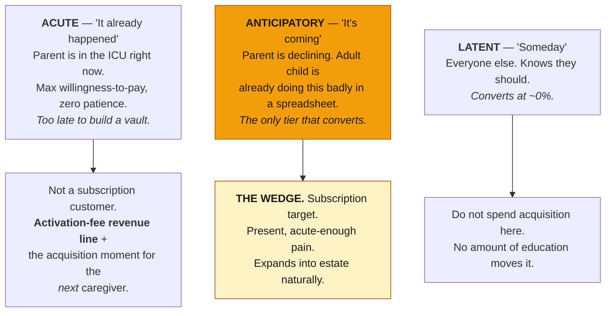

The acute tier is strategically important but is **not a subscription customer** — by the time the
crisis lands there is no time to populate a vault. Its correct commercial treatment is the
**estate/trigger activation fee** (Build Spec §24) and, critically, as an *acquisition channel*: the
caregiver who just went through an unassisted crisis is the highest-intent prospect that exists.
Journey 9 and Journey 10 are therefore designed to end in a referral moment, not merely a completed
transaction.

### 3. The three-body problem — the wedge's defining structural fact

This is the most important product finding in this analysis, and the current build does not model it.

In the caregiver wedge, three roles that the schema assumes are one person are actually three:

| Role | Who | What they do |
|---|---|---|
| **Buyer** | Adult child | Feels the pain, finds the product, pays |
| **Data owner** | Aging parent | Owns the accounts, the credentials, the legal authority |
| **Recipient** | Adult child (again) | Receives access when the trigger fires |

Everything under `src/app/(owner)/*` is built for someone organizing **their own** life. It assumes
`owner = buyer = the person with the accounts`. But the person with the accounts is a 78-year-old
who will not drive a TOTP enrolment and a 300-row CSV import, and the person with the motivation has
no legitimate standing to simply take custody of their parent's credentials.

**If the product cannot be set up by the child, for the parent, with the parent's recorded consent,
the wedge does not convert.** That is why Journey 3 earns a top-10 slot ahead of several capabilities
that already exist.

It also introduces the single largest *harm* risk in the product: elder financial abuse. A tool that
lets an adult child assemble complete access to an aging parent's financial life is a tool that can
be misused by exactly the person it is designed to empower. Journey 3's anti-abuse controls are not
optional hardening — they are the journey's core requirements.

### 4. Competitive frame — what the journeys must prove

From `docs/COMPETITORS.md` (authored 2026-07-01; treat as stale past 60 days and re-verify before
external use):

- **Everplans at $99.99/yr is the price anchor.** The category demonstrably supports a meaningful
  annual price. Relay should test at or above it, not below.
- **Reversibility is the one capability no competitor has.** Everplans' deputies are share-grants.
  1Password/Bitwarden emergency access is an all-or-nothing waiting-period handoff. Apple Legacy
  Contact and Google Inactive Account Manager are single-ecosystem, binary, unverified, and mostly
  death-only. Nobody competes on *release correctness*.
- **The real acquisition obstacle is "my phone already does that"** — the free platform features set
  the consumer's default expectation. The journeys must sell the *cross-platform, verified,
  reversible* delta, not the concept of a vault.

This translates directly into journey design: **the reversal is a designed, first-class journey
(Journey 9), not an error path.** It is the demo, the differentiator, and the price justification.

### 5. Primary demand usage

Across the five trigger types, the volume distribution is heavily skewed:

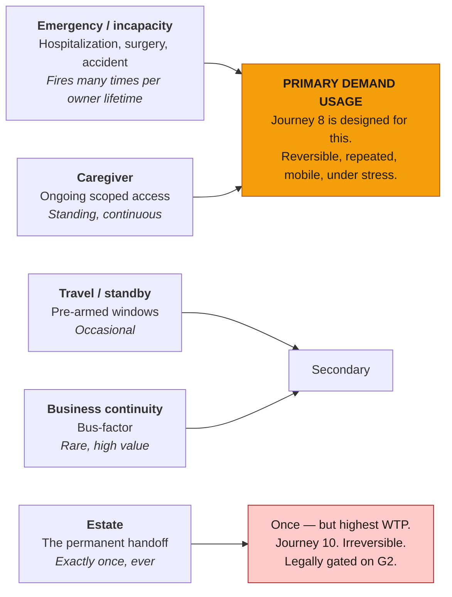

**The emergency/incapacity path is the primary demand usage.** It fires repeatedly, it is reversible,
it happens on a phone at 2am under maximum stress, and it is the experience that determines whether
the owner renews. Journey 8 is specified in the most detail for this reason.

### 6. Business implications summary

| Finding | Journey consequence |
|---|---|
| Value sits decades away → engagement collapses | J5 (living habit) is a required journey, not a nice-to-have |
| Only anticipatory demand converts | J1 qualifies behaviorally, not demographically |
| Buyer ≠ data owner ≠ recipient | J3 (assisted setup) exists; delegation model is net-new |
| Elder abuse is the product's harm vector | J3 anti-abuse controls are core requirements |
| Reversibility is the sole uncontested differentiator | J9 is a designed journey with its own artifact |
| Trust is the acquisition barrier, not features | "Legible zero-knowledge" moments are journey steps (J1.5, J7.2) |
| Verification network has a cold-start problem (§27) | J6's owner-challenge-first preserves scarce verifier attention |
| A false release is existential | J6, J7, J10 all compose evidence rather than trusting one signal |
| Acute tier is an acquisition channel, not a customer | J9 and J10 end in referral moments |
| Estate is the highest-WTP moment | J10's executor packet is the activation-fee product |

---

## Part II — The journey map

### Actors

| Actor | Definition | Auth model |
|---|---|---|
| **Owner** | Registered user whose vault it is. Holds all authority. | NextAuth + mandatory TOTP `[BUILT]` |
| **Delegate** | Helper with scoped setup rights on another person's vault. Cannot read secrets they did not enter. | `[GAP]` |
| **Recipient** | Designated to receive scoped access when a trigger fires. | Scoped HS256 JWT carrying `release_state_id` + `version` `[BUILT]`; standing claimed account `[GAP]` |
| **Verifier** | Trusted third party who confirms or denies that a trigger condition is real. Never sees vault contents. | Signed single-use link, no account `[GAP]` |
| **Executor** | A recipient with `role = 'executor'` on the estate trigger. | As recipient, plus identity verification `[P2]` |

### The ten journeys in lifecycle order

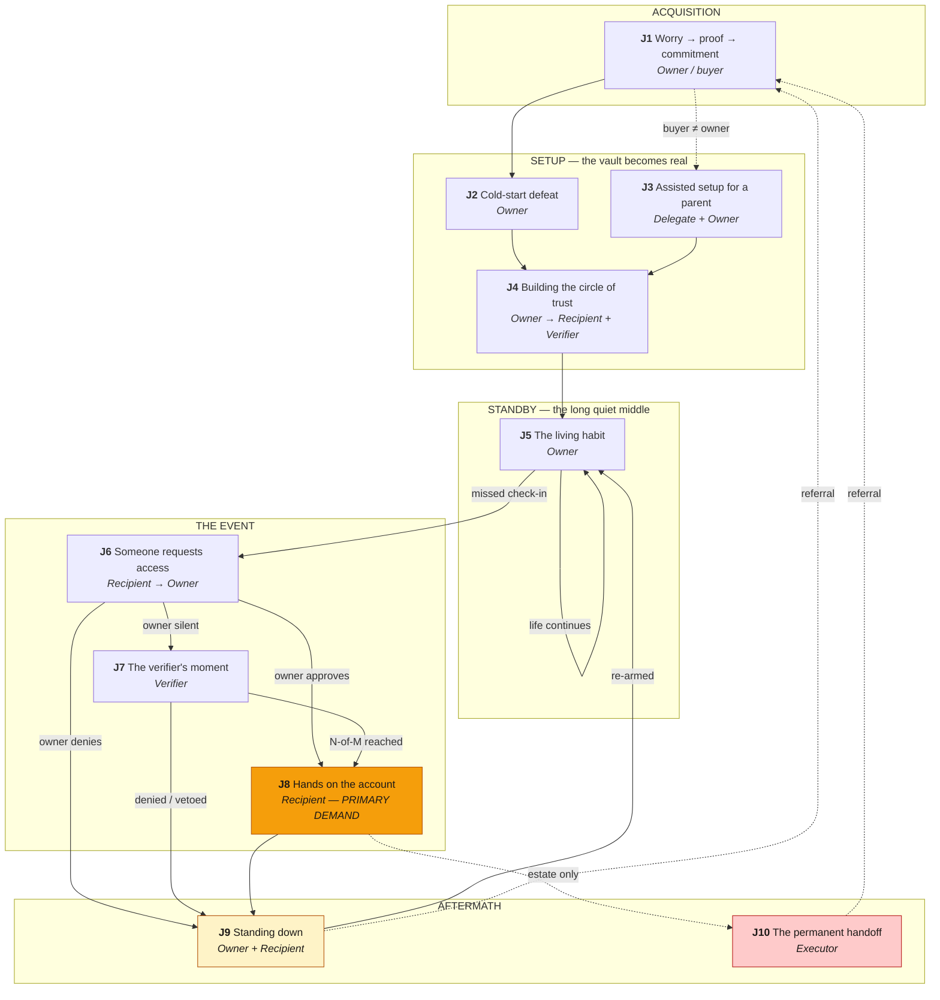

### Summary table

| # | Journey | Actor | Trigger | Success condition | State |
|---|---|---|---|---|---|
| 1 | Worry → proof → commitment | Owner/buyer | Precipitating life event | Paid subscription + seeded vault | `[GAP]` |
| 2 | Cold-start defeat | Owner | Paid, vault near-empty | ≥80% of accounts present and ranked | `[BUILT]`+ |
| 3 | Assisted setup for a parent | Delegate + Owner | Buyer ≠ data owner | Consented delegation, vault populated | `[GAP]` |
| 4 | Building the circle of trust | Owner → all | Vault continuity-ready | Circle complete, all invitees claimed | `[BUILT]`+ |
| 5 | The living habit | Owner | Recurring cadence | ≥1 interaction/quarter, renewal | `[BUILT]`+ |
| 6 | Someone requests access | Recipient → Owner | Real-world emergency | Correct routing in minutes | `[GAP]` |
| 7 | The verifier's moment | Verifier | `PENDING` entered | Accurate decision in <2 min | `[GAP]` |
| 8 | Hands on the account | Recipient | `RELEASED` | Top-3 urgent actions completed | `[BUILT]`+ |
| 9 | Standing down | Owner + Recipient | Owner recovers | Access sealed, receipt issued | `[BUILT]`+ |
| 10 | The permanent handoff | Executor | Verified death | Provider transitions complete | `[P2]` |

---

## Part III — Cross-cutting requirements

These bind **every** journey. They are stated once here rather than repeated ten times.

| ID | Requirement | Source | State |
|---|---|---|---|
| **CC1** | Plaintext secrets never exist server-side. Per-item AES-GCM-256 data key generated in-browser; KMS wraps the key; server stores only `ciphertext`, `wrapped_data_key`, `kms_key_id` + non-secret metadata. | R2.1–2.3 | `[BUILT]` |
| **CC2** | AI agents receive metadata only. `getVaultMetadata()` is the sole permitted accessor inside `/api/ai/*`; it excludes `ciphertext`, `wrapped_data_key`, `kms_key_id`. The Intake Agent IAM role is denied `kms:Decrypt`. | R11.5, R17.4 | `[BUILT]` |
| **CC3** | Every state change and access event is written to the append-only, per-owner hash-chained audit log. Audit failure **blocks** the triggering operation; it is never best-effort. | R8.1–8.7 | `[BUILT]` |
| **CC4** | **Safe default.** Any ambiguous outcome or OCC-retry exhaustion leaves the release row in `ARMED`. A release must never be left in a partially-releasing state. | R5.9 | `[BUILT]` |
| **CC5** | Every authorization decision reads `release_state` with strong consistency. Cached or eventually-consistent reads are never used to authorize. | R15.1 | `[BUILT]` |
| **CC6** | All triggers except `estate` are reversible. Irreversibility requires explicit, recorded owner consent at configuration time. | R3.5, R5.10 | `[BUILT]` |
| **CC7** | Every release carries one human-readable **case ID**, referenced in every notification to every actor. Three parties coordinating by phone during a crisis need a shared referent. | new | `[GAP]` |
| **CC8** | **Accessibility is a functional requirement, not a polish item.** The wedge means elderly owners and recipients operating under acute stress. Minimum 18px body text in Access mode, WCAG AA contrast, no countdown-pressure patterns on irreversible actions, functional on a five-year-old phone, printable fallback for every critical instruction. | §23, wedge | `[BUILT]`+ — Access mode is already 18–20px bold; WCAG AA audit, printable fallbacks, and low-end-device testing are unverified |
| **CC9** | **Dead-man's-switch on the scheduler.** The heartbeat cron's success signal is a side effect. Absence of that signal must itself be alarmed — a silently-dead scheduler means no trigger ever fires and the entire product has failed invisibly while every page still renders 200. | portfolio rule | `[GAP]` |
| **CC10** | Least privilege throughout: mandatory MFA on owner accounts, IAM-based DSQL auth with no static passwords, per-owner row predicates on every query, HTTPS enforced at the edge. | R17.1–17.6 | `[BUILT]` |

> **CC9 deserves emphasis.** It is the single most dangerous failure mode in the system. Every UI
> surface can be green, every test can pass, and the product can be completely non-functional because
> a Vercel Cron job stopped firing. Nothing currently detects that.

---

## Part IV — The ten journeys

---

## J1 — Worry → proof → commitment

**Actor:** Adult child (buyer, prospective owner or delegate)
**Trigger:** A precipitating event — a parent's fall, a diagnosis, a hospital discharge with a folder of paperwork, a sibling conversation that went badly.
**Success:** Paid annual subscription, vault seeded to the free-tier cap, risk-graph reveal viewed. (Designating recipients belongs to J4, not here.)
**Business stake:** This is the entire revenue path. `PROJECT.yaml` records `monetization_path: none` — there is zero billing code today.

### The optimization that defines this journey

**The paywall moves behind the "aha".** The current funnel runs landing → interest form, with no
product in between: it asks for commitment before demonstrating value. The optimized funnel seeds a
small free vault, runs the importance engine on it, and delivers the risk-graph reveal **first** —
then prices. This mirrors Everplans' free-tier-capped-at-10-items shape, and it converts a claim
("we'll organize your parent's affairs") into a demonstrated fact ("your mother's Gmail is the reset
path for 6 of the 8 accounts you just entered").

> **The seed must stay inside the free cap for the reveal to work.** The prompted checklist is 8
> items against a 10-item free tier — enough entries for the dependency graph to show real edges,
> with headroom left. A reveal that requires more items than the free tier permits is not a reveal.

It also **relocates the G1 measurement to a much stronger instrument.** Today `g1-caregiver-wtp`
measures landing-click → interest-form — intent expressed before any value is shown. Measuring
reveal → checkout instead captures willingness-to-pay *after* the product has proven the stakes.
That is the number the gate is actually trying to learn.

### Happy path

| # | Step | State |
|---|---|---|
| 1 | Lands on `/caregivers` from search, paid, or a community channel. Headline leads with **reversibility**, not storage. | `[BUILT]` |
| 2 | Qualifies **behaviorally, not demographically** — "Are you managing someone else's affairs?" gates into the flow rather than into a form. | `[BUILT]` |
| 3 | Starts a free starter vault: email + passkey or TOTP enrolment. No credit card. | `[GAP]` |
| 4 | **Prompted seed, not a blank vault.** "Name the accounts you'd need first if they were hospitalized tomorrow" — an 8-item caregiver-archetype checklist: primary email, phone carrier, primary bank, health insurance, pharmacy/patient portal, utilities, mortgage or rent, and the password manager. Eight against a 10-item cap leaves headroom. | `[GAP]` |
| 5 | First save runs client-side encryption, with a **legible zero-knowledge moment**: show the actual ciphertext leaving the browser. Trust is the acquisition barrier; make the guarantee visible, not merely true. | crypto `[BUILT]`, reveal `[GAP]` |
| 6 | Intake Agent scores the seed. **The reveal:** the risk graph renders — "your mother's Gmail is the reset path for 6 of the 8 accounts you just entered. If you can't get into it, you can't reset any of them." | engine `[BUILT]`, framing `[GAP]` |
| 7 | Paywall lands **here**, at peak demonstrated value. Free tier caps at 10 items / 1 recipient / no release capability. Price tested at or above $99/yr. | `[GAP]` |
| 8 | Checkout → entitlement provisioned → lands directly in the setup wizard (J2), never on a dashboard with nothing on it. | `[P2]` billing |

### Process flow

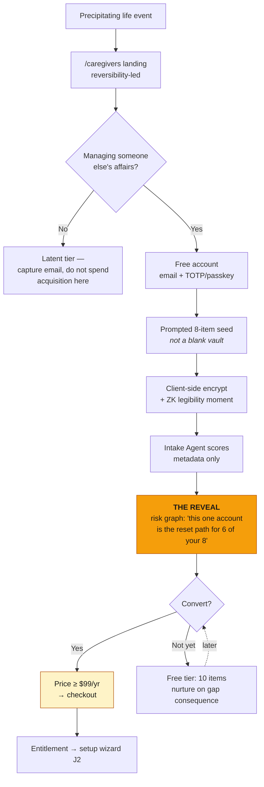

### Data flow

| Step | Reads | Writes | Boundary |
|---|---|---|---|
| 3 | — | `users` (email, auth_sub, checkin_interval_days=30) | — |
| 4–5 | — | `vault_items` (ciphertext, wrapped_data_key, kms_key_id + metadata) | **Plaintext never leaves browser.** SubtleCrypto generates the data key; `POST /api/kms/wrap` wraps it |
| 6 | `getVaultMetadata(ownerId)` — metadata only | `vault_items` importance flags: `is_root_credential`, `recurring_billing`, `irreplaceable`, `importance_score`, `depends_on_item_id` | **AI sees no ciphertext.** Intake role denied `kms:Decrypt` |
| 7–8 | entitlement | `subscriptions` *(new table)*, `audit_log` | — |

### Requirements

- **J1-R1** The landing surface SHALL lead with reversibility, not storage or organization.
- **J1-R2** Qualification SHALL be behavioral. No demographic form SHALL gate entry to the product.
- **J1-R3** A prospect SHALL be able to create an encrypted item before any payment is requested.
- **J1-R4** The seed step SHALL present a prompted caregiver-archetype checklist. A blank vault SHALL NOT be the first-run experience.
- **J1-R5** The first save SHALL surface a visible artifact of client-side encryption. The zero-knowledge guarantee SHALL be legible to a non-technical user, not merely documented.
- **J1-R6** The risk-graph reveal SHALL render before the price is shown, and SHALL name a specific dependency count derived from the user's own entries.
- **J1-R7** The free tier SHALL cap at 10 items and 1 recipient, and SHALL NOT permit any release. Cap enforcement SHALL be server-side.
- **J1-R8** The price point SHALL be configurable without deploy, to permit price testing under G1.
- **J1-R9** The G1 click-to-intent metric SHALL be measured at reveal → checkout, not landing → form.
- **J1-R10** Every funnel event SHALL be keyed by inbound channel so per-channel conversion is computable, and event emission SHALL be verified to actually fire before any gate reading is treated as a verdict.

> **J1-R10 exists because this exact instrument silently emitted nothing on 2026-08-05.** An empty
> analytics dashboard and a broken instrument are indistinguishable. Prove events fire before
> reading the gate.

### Failure branches

| Branch | Handling |
|---|---|
| Encryption fails at first save | Abort, surface a browser-visible error, transmit nothing. Silent abort is not acceptable (R2.7) |
| Intake Agent times out | Default `importance_score = 0.5`, warn which items defaulted, never block item creation (R11.9) |
| Prospect abandons after seed | Free tier persists. Nurture on **gap consequence**, never on generic reminders |
| Payment declines | Vault and seed persist intact at free-tier caps. Never destroy entered data on a billing failure |

---

## J2 — Cold-start defeat

**Actor:** Owner (or Delegate acting under J3)
**Trigger:** Paid subscription, vault holds only the seed.
**Success:** ≥80% of the real account surface present, scored, and the top consequence gaps closed. Under 30 minutes of human attention.
**Business stake:** The gap between a 10-item toy and a 300-item real vault is the gap between a cancelled trial and a renewed subscription.

### The optimization that defines this journey

**Review by exception.** The current vault dashboard renders every item grouped by category. Asking
a human to review 300 imported rows defeats the entire purpose of the importance engine — and it is
precisely the triage burden the product exists to remove. The optimized flow surfaces only what
carries consequence: the root credentials, the irreplaceables, and anything scored ≥0.7 — roughly 20
items out of 300 — each with its reasoning and an override. The remaining ~280 collapse behind a
single line: *"280 others, scored and filed."*

### Happy path

| # | Step | State |
|---|---|---|
| 1 | Import offers three lanes: password-manager CSV; document upload (statements, bills, policies → extraction); email-signal account discovery. | CSV `[BUILT]`, docs `[P2]`, email `[P2]` |
| 2 | CSV parsed **entirely client-side** — 1Password, Bitwarden, LastPass, Chrome, Firefox formats. No raw CSV ever reaches the server. | `[BUILT]` |
| 3 | Rows deduped case-insensitively on `service_name` + `url`; every skip reported with its row number and specific reason. | `[BUILT]` |
| 4 | Each row encrypted client-side before upload. **Any encryption failure aborts the entire batch** — no partial uploads, including rows that already succeeded. | `[BUILT]` |
| 5 | Intake Agent scores the batch on metadata only: 300 items within 30 seconds. | `[BUILT]` |
| 6 | **Review by exception** — only root credentials, irreplaceables, and `importance_score ≥ 0.7` are surfaced, each with reasoning and an owner override that persists across re-analysis. | `[GAP]` |
| 7 | Risk graph renders with `depends_on_item_id` edges and a "gates N" count per item. | `[BUILT]` |
| 8 | Prioritization Agent lists gaps ranked by consequence with plain-language explanations. Owner closes the top three. | engine `[BUILT]`, top-3 framing `[GAP]` |
| 9 | Vault reaches an explicit **continuity-ready** state: ≥1 recipient designated, every root credential carries a `backup_note`, no `CUSTODY_RISK` remains on any irreplaceable item. | `[GAP]` |

### Process flow

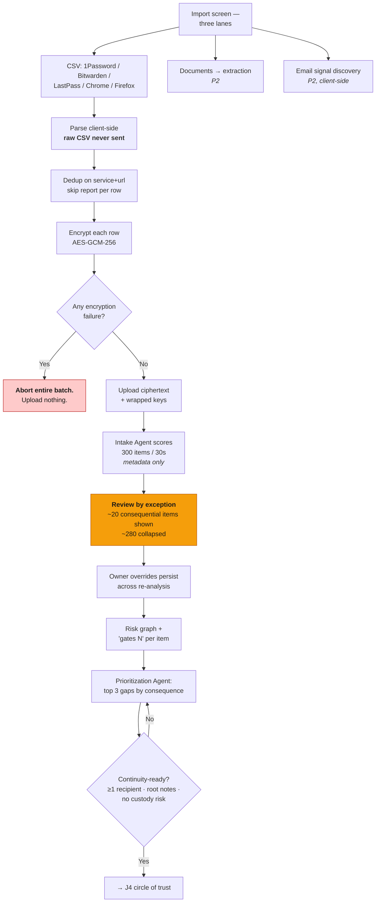

### Data flow

| Stage | Location | Data | Boundary |
|---|---|---|---|
| Parse | Browser | Raw CSV, plaintext credentials | **Never transmitted** (R10.2) |
| Encrypt | Browser | Per-item AES-GCM-256 data key via SubtleCrypto | Plaintext key never leaves browser |
| Wrap | `POST /api/kms/wrap` | Data key → KMS CMK | Server never logs the plaintext data key |
| Persist | `POST /api/vault/items` → DSQL | `ciphertext`, `wrapped_data_key`, `kms_key_id`, metadata | Zero plaintext at rest (R2.3) |
| Score | `/api/ai/intake` | `getVaultMetadata()` — title, service_name, url, category, type | **Ciphertext columns excluded at the query** (R11.5) |
| Write back | DSQL | `is_root_credential`, `recurring_billing`, `irreplaceable`, `importance_score` ∈ [0,1], `depends_on_item_id` | Score clamped to [0.0, 1.0] |
| Gaps | `/api/ai/prioritize` | Metadata + flags | Never calls `kms:Decrypt` (R12.5) |

### Requirements

- **J2-R1** CSV parsing SHALL occur entirely client-side. No raw CSV content or plaintext credential SHALL be transmitted at any point.
- **J2-R2** Import SHALL support ≥300 rows, completing parse-encrypt-upload within 60 seconds.
- **J2-R3** Encryption failure on any row SHALL abort the whole import with zero partial upload.
- **J2-R4** Row-level parse failures SHALL be skipped with row number and reason, and processing SHALL continue.
- **J2-R5** Duplicates SHALL be detected case-insensitively on `service_name` + `url` and reported, not silently dropped.
- **J2-R6** Post-import review SHALL surface only consequential items. The owner SHALL NOT be required to review every imported row.
- **J2-R7** Every automated classification SHALL display its reasoning and SHALL be owner-overridable. Overrides SHALL persist and SHALL NOT be overwritten by re-analysis.
- **J2-R8** Scoring failure SHALL default to 0.5, warn which items defaulted, and SHALL NOT block item creation.
- **J2-R9** The system SHALL define and display an explicit **continuity-ready** state with its unmet conditions named.
- **J2-R10** Import sources SHALL be re-runnable, with re-import detecting and reporting drift rather than duplicating.

---

## J3 — Assisted setup for a parent

**Actor:** Delegate (adult child) + Owner (parent)
**Trigger:** The buyer is not the person whose accounts these are.
**Success:** Recorded parent consent, delegated setup rights active, vault populated, no unilateral self-grant possible.
**Business stake:** **The wedge does not convert without this.** Also the product's principal harm vector.
**State:** `[GAP]` — entirely net-new. No delegation concept exists in the schema.

### The design decision

Three models were considered:

| Model | Assessment |
|---|---|
| **(a)** Child is the owner; parent's data lives in the child's vault | **Rejected.** No consent record, no legal standing, and it destroys the reversibility story — the child simply *has* the access permanently, so there is nothing to release and nothing to reverse |
| **(b)** Parent is the owner; child is a scoped **delegate** | **Selected.** Preserves ownership, consent, reversibility, and the audit trail |
| **(c)** Household vault with co-owners | Deferred to Phase 2 (§23 family plans) |

**The honest boundary of the delegate model.** A delegate who types a credential into the vault
obviously knows that credential. The guarantee is therefore precise and limited, and must be stated
to users in exactly these terms:

> A delegate cannot read items they did not personally enter, cannot arm or disarm a trigger, cannot
> grant themselves access without the owner's approval, and every action they take is logged and
> reported to the owner.

That is a real and valuable guarantee. It is not "the delegate learns nothing," and the product must
never imply that it is.

### Happy path

| # | Step | State |
|---|---|---|
| 1 | Buyer selects "I'm setting this up for someone else" during J1. | `[GAP]` |
| 2 | The parent is created as the **owner**; the buyer becomes a pending delegate. Consent invitation goes out by email, SMS, **or a printable one-pager** for a non-digital parent. | `[GAP]` |
| 3 | Parent consents through the lowest-friction path that preserves evidence: one-tap link, in-person tap on the child's device, or a signed paper form the child uploads. **Consent is recorded in the audit log as a first-class artifact**, with method and timestamp. | `[GAP]` |
| 4 | Parent enrols an authenticator, or explicitly elects an assisted-authentication mode that is flagged, time-limited, and revocable at any time. | `[GAP]` |
| 5 | Delegate scopes activate: create/update items, propose recipients and policies, run imports. **Cannot** decrypt items they did not create, arm/disarm triggers, or designate themselves as a recipient. | `[GAP]` |
| 6 | Delegate runs J2 against the parent's vault. | `[GAP]` — import mechanics are `[BUILT]`, but every route is owner-scoped today; running them in a delegate context is entirely net-new |
| 7 | **Parent approval queue** — recipients, access policies, and *especially* any designation of the delegate as a recipient require the parent's explicit approval. One screen, plain language, large type. | `[GAP]` |
| 8 | Parent receives a monthly "what was done on your behalf" digest, and can revoke delegation instantly from any surface. | `[GAP]` |

### Process flow

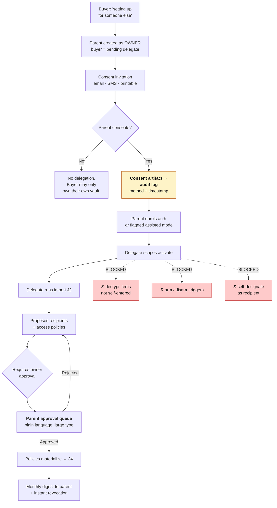

### Data flow

| Step | Writes | Notes |
|---|---|---|
| 2 | `users` (parent, as owner) · `delegations` *(new)* | `delegations`: `owner_id`, `delegate_user_id`, `scopes[]`, `consent_artifact_id`, `granted_at`, `revoked_at` |
| 3 | `consent_artifacts` *(new)* · `audit_log` | Method ∈ `link` / `in_person` / `paper_upload`; retained for the life of the vault |
| 5–6 | `vault_items` with `created_by_delegate_id` | Delegate read-authorization checks `created_by_delegate_id = self` |
| 7 | `approvals` *(new)* | Every delegate proposal enters this queue; nothing self-grants |
| 8 | `audit_log` query by actor `delegate:<id>` | Digest is generated from the audit chain, not a separate log |

Audit `actor` extends from `owner:<id>` / `recipient:<id>` / `system` / `cron` to include
`delegate:<id>`. This is additive to the existing enum.

### Requirements

- **J3-R1** The system SHALL support a vault whose owner is a different person from the paying buyer.
- **J3-R2** Delegation SHALL NOT activate without a recorded consent artifact from the owner, including method and timestamp.
- **J3-R3** Consent SHALL be obtainable through a non-digital path. A parent without a smartphone SHALL NOT be a blocker.
- **J3-R4** A delegate SHALL NOT decrypt any vault item they did not personally create.
- **J3-R5** A delegate SHALL NOT arm, disarm, initiate, or cancel any trigger.
- **J3-R6** A delegate SHALL NOT designate themselves as a recipient without explicit owner approval recorded separately from the delegation consent.
- **J3-R7** Every delegate action SHALL be written to the audit log with actor `delegate:<id>`.
- **J3-R8** The owner SHALL receive a periodic digest of delegate activity and SHALL be able to revoke delegation instantly from any authenticated surface.
- **J3-R9** The owner-approval queue SHALL meet CC8 accessibility requirements without exception.
- **J3-R10** The system SHALL warn when a single delegate is also the sole recipient and sole verifier, and SHALL recommend a second independent party. Concentration of all three roles in one person is the elder-abuse signature.
- **J3-R11** Delegate scope claims SHALL be enforced server-side on every request. Client-side scope hiding SHALL NOT be the enforcement mechanism.

> **J3-R10 is a safety requirement, not a UX suggestion.** The configuration it detects — one adult
> child holding delegate, recipient, and verifier roles simultaneously — is the precise structure
> that enables undetectable elder financial abuse.

---

## J4 — Building the circle of trust

**Actor:** Owner → Recipient + Verifier
**Trigger:** The vault is continuity-ready but nobody is designated.
**Success:** ≥2 recipients, ≥3 verifiers with N-of-M configured per trigger type, every invitee claimed, 100% of critical items covered by a policy.
**Business stake:** A vault with no circle is a password manager. The circle *is* the product.

### The two optimizations that define this journey

**1. One people list, roles as attributes.** `lib/people/recipients.ts` and `lib/people/verifiers.ts`
are separate modules writing to separate tables — so an owner naming their spouse as both a recipient
and a verifier enters that person twice, maintains two records, and sees them as two entities. Unify
to one people list with role tags. The underlying `recipients` and `verifiers` tables can remain as
projections; the *entry experience* must be single.

**2. Access rules become policies over attributes.** Today `access_rules` is one row per
`(vault_item_id × recipient_id × trigger_type)`. At 300 items × 3 recipients that is up to 900 rows
the owner must hand-create — and every newly imported item lands **uncovered by default**, silently.

The fix is an `access_policies` layer holding predicates over item attributes — category,
criticality, `is_root_credential`, `irreplaceable` — that **materializes into the existing
`access_rules` table**. New items matching a policy are automatically covered on insert.

> **This is deliberately additive.** `access_rules` remains the authoritative grant table. The KMS
> unwrap path still checks `access_rules` exactly as it does today, so Property 6 and every existing
> test hold unchanged. No module contract is altered — a new layer writes to the same table the
> existing layer already writes to.

The importance engine then **proposes** the initial policy set — it already knows which items are
root credentials and which are critical-finance — and the owner approves or edits in bulk rather
than authoring from scratch.

### Happy path

| # | Step | State |
|---|---|---|
| 1 | Owner names each person **once**, tagging roles: recipient / verifier / both / executor. | `[GAP]` (unification) |
| 2 | **Auto-proposed policies** from the importance engine: *"Sarah (daughter, caregiver) → view on all critical finance and health items on the emergency trigger; act on utilities."* | `[GAP]` |
| 3 | Owner approves or edits in bulk. Policies materialize into `access_rules` rows. | `[GAP]` |
| 4 | **Coverage matrix** renders — people × item groups — with any uncovered critical item flagged. | `[GAP]` |
| 5 | Estate policies are forced `reversible = false`; the irreversibility is explained and explicitly consented to, not silently applied. | `[BUILT]` |
| 6 | N-of-M configured per trigger type with proposed defaults: emergency 1-of-3 plus owner challenge; estate 2-of-3 plus death evidence. `N ≥ 1`, `M ≥ 1`, `N ≤ M` enforced. | validation + storage `[BUILT]`, proposed defaults `[GAP]` |
| 7 | Invitations sent. **Recipients claim in calm** — account created, identity verified once, and they see a **standby view**: the *shape* of what they would receive ("12 items across finance and health"), never titles of sensitive items, never contents. | `[GAP]` / KYC `[P2]` |
| 8 | Verifiers claim with **no account** — they confirm their contact channel and read a plain-language statement of their duty and its limits. | `[GAP]` |
| 9 | Owner sees an explicit **circle-complete** state: every trigger has sufficient verifiers, every critical item has a recipient. | `[GAP]` |

### Process flow

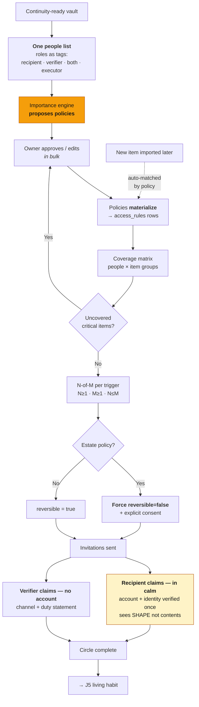

### Data flow

| Step | Reads | Writes |
|---|---|---|
| 1 | — | `recipients`, `verifiers` (projections of one entry experience) |
| 2 | `getVaultMetadata()` — importance flags, categories, criticality | — (proposal only, nothing persisted until approved) |
| 3 | `access_policies` *(new)* | `access_rules` (materialized: `vault_item_id`, `recipient_id`, `trigger_type`, `scope`, `reversible`) |
| 4 | `access_rules` ⋈ `vault_items` | — |
| 6 | — | `release_state` (`required_confirmations`, one row per `owner_id` × `trigger_type`, default `armed`) |
| 7 | — | `invitations` *(new)*, `identity_verifications` *(new, P2)* |
| all | — | `audit_log` |

**Referential integrity is application-enforced** — DSQL has no FK constraints. Every policy
materialization calls `assertOwns` and `assertNoCrossOwner`; recipient deletion calls
`cascadeDelete` on dependent `access_rules` before committing (R3.6, R16.2).

### Requirements

- **J4-R1** A person SHALL be entered once regardless of how many roles they hold.
- **J4-R2** The system SHALL propose an initial access-policy set derived from importance-engine output. The owner SHALL NOT be required to author policies from an empty state.
- **J4-R3** Access policies SHALL be expressed as predicates over item attributes and SHALL materialize into `access_rules`. The materialized table SHALL remain the sole authority consulted by the KMS unwrap path.
- **J4-R4** A vault item created after a policy exists SHALL be automatically covered if it matches that policy, and the owner SHALL be notified of newly-covered items.
- **J4-R5** The coverage matrix SHALL flag every critical item not covered by any policy.
- **J4-R6** Estate policies SHALL be rejected if `reversible = true`, with an explicit error stating estate rules must be irreversible.
- **J4-R7** Irreversibility SHALL require an explicit, recorded consent interaction. It SHALL NOT be applied silently as a side effect of choosing a trigger type.
- **J4-R8** N-of-M configuration SHALL enforce `N ≥ 1`, `M ≥ 1`, `N ≤ M` and SHALL reject violations with a validation error.
- **J4-R9** Recipients SHALL claim their role and complete identity verification **before** any trigger fires.
- **J4-R10** The recipient standby view SHALL disclose the shape of the grant — counts and categories — and SHALL NOT disclose item titles for sensitive categories or any content.
- **J4-R11** ⚠️ **AMENDED 2026-08-11 — `docs/standby-architecture.md` (hybrid+6).** Was: *"Verifiers
  SHALL NOT be required to create an account."* That contradicted the standby architecture, which
  asks every named person to bind an identity in calm so that nothing secret has to be transmitted
  at release time. The requirement's **intent** was no friction wall for a person who may act once
  in five years, not a literal ban on identity — so it is restated at that intent rather than
  discarded: verifiers SHALL NOT be required to invent a password, verify an email address, or
  install an app. A one-tap device binding (**[A1]** stage one) is permitted and is the lowest
  friction identity available. Whether real verifiers complete even that is the question Phase 0
  exists to answer; if they do not, this requirement is the one to revisit first.
- **J4-R12** Verifier onboarding SHALL state plainly that the verifier will never see vault contents.
- **J4-R13** The system SHALL define an explicit circle-complete state and name its unmet conditions.
- **J4-R14** Editing or deleting a policy SHALL reconcile its materialized `access_rules` rows in the same operation, and the owner SHALL be shown which grants are being revoked **before** confirming. A policy edit that silently widens access is the inverse of the coverage bug it fixes.
- **J4-R15** Deleting a vault item or a recipient SHALL cascade-delete the dependent `access_rules` rows in application logic before the parent delete commits, and SHALL NOT leave a policy that would silently re-materialize the grant.

> **J4-R9 is the single highest-leverage change in this document.** Today a recipient's first-ever
> contact with Relay is a raw `?token=` URL arriving at the worst moment of their life. Moving claim
> and identity verification to designation time removes *all* identity friction from Journey 8, and
> creates the relationship that makes the referral loop possible.

---

## J5 — The living habit

**Actor:** Owner
**Trigger:** Recurring — the system's own cadence.
**Success:** ≥1 meaningful interaction per quarter, vault drift under 10%, renewal.
**Business stake:** This journey *is* retention. Everything else in the product is worthless if the owner forgets Relay exists between the setup and the crisis.

### The optimization that defines this journey

**Passive liveness first, with an escalation ladder before `PENDING`.**

Requiring an owner — frequently elderly — to click a check-in link every 30 days is a
false-positive machine, and **a false `PENDING` is the fastest way to destroy trust in this product.**
It notifies verifiers, alarms recipients, and teaches everyone to ignore Relay's alerts.

The optimized model derives liveness from actual product usage, and escalates through the owner's
own channels before ever advancing the state machine:

```
any authenticated action → last_active_at    (silent, zero friction)
        ↓ overdue
in-app notice → email → SMS → secondary channel → voice
        ↓ all exhausted, still silent
                ARMED → PENDING            (verifiers finally notified)
```

Only when the entire ladder is exhausted does the state machine move.

### Happy path

| # | Step | State |
|---|---|---|
| 1 | Any authenticated action updates `last_active_at`. The owner never performs a ritual check-in in the normal case. | endpoint `[BUILT]`, passive derivation `[GAP]` |
| 2 | Cadence configurable 1–365 days, default 30. **Per-trigger cadence** — estate and business continuity warrant a heartbeat; emergency is better served by recipient-initiated request plus owner challenge (J6). | base `[BUILT]`, per-trigger `[GAP]` |
| 3 | The escalation ladder runs before any state transition. | `[GAP]` |
| 4 | **Quarterly continuity review**, three minutes, consequence-ranked and specific: *"2 new accounts appeared in your import source. Sarah's phone number is bouncing. Your Gmail still has no recovery note — it gates 12 accounts."* | engine `[BUILT]`, packaging `[GAP]` |
| 5 | Life-event prompts on detectable change: address, new financial institution, a recipient's channel going dead. | `[GAP]` |
| 6 | **Renewal is a value receipt**, delivered at the churn decision point: *"Your vault covers 287 accounts. 12 root credentials protected. 3 gaps closed this year. 0 false releases."* | `[GAP]` |

### Process flow

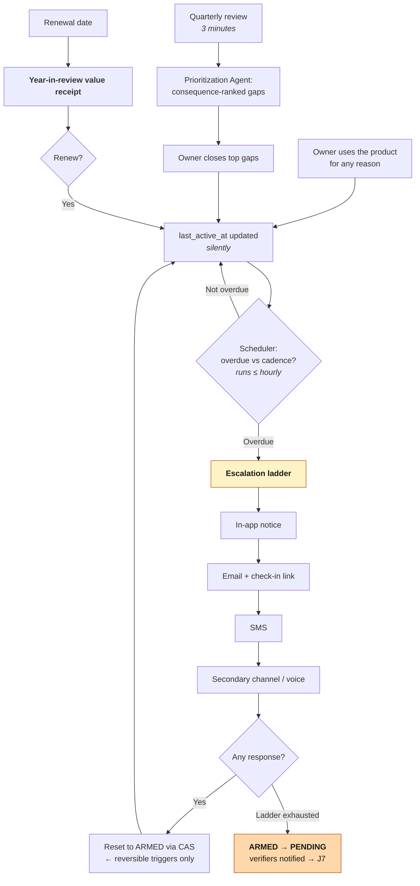

### Data flow

| Step | Reads | Writes |
|---|---|---|
| 1 | — | `users.last_active_at` |
| 2 | `users.checkin_interval_days` (1–365, default 30) | `users` on change |
| 3 | `users`, `release_state` | `notifications`, `audit_log` |
| Scheduler | All active owners, ≤1h interval | `release_state` CAS `armed → pending` via `withOccRetry`; transient failure retries with exponential backoff (base 5s, max 3) before logging and continuing to the next owner |
| 4 | `getVaultMetadata()` | Gap records; resolved gaps clear within 2s of the item update without a full rescan |

> **CC9 applies with full force here.** The scheduler is the beating heart of the entire product, and
> its success signal is a side effect. If Vercel Cron stops firing, no trigger ever fires again —
> and every page still returns 200. The absence of the heartbeat run must itself be alarmed.

### Requirements

- **J5-R1** Liveness SHALL be derived from authenticated product activity. An explicit check-in ritual SHALL be a fallback, not the primary mechanism.
- **J5-R2** `checkin_interval_days` SHALL accept 1–365, default 30, and reject out-of-range values.
- **J5-R3** Cadence SHALL be configurable per trigger type.
- **J5-R4** A full escalation ladder across all registered owner channels SHALL be exhausted before any `ARMED → PENDING` transition.
- **J5-R5** The scheduler SHALL evaluate all active owners at intervals no greater than one hour.
- **J5-R6** Scheduler transient failures SHALL retry with exponential backoff (base 5s, max 3 attempts) and SHALL NOT halt evaluation of remaining owners.
- **J5-R7** **The absence of a scheduler run SHALL raise an alert.** A successful run SHALL emit a heartbeat metric, and a no-signal-in-N-hours condition SHALL alarm.
- **J5-R8** An owner heartbeat during `PENDING` or `GRACE` SHALL return reversible triggers to `ARMED` via CAS, and SHALL reject the reset for `estate` with an explicit error.
- **J5-R9** The quarterly review SHALL present gaps ranked by consequence with plain-language explanation, never as an undifferentiated checklist.
- **J5-R10** The renewal surface SHALL present a quantified year-in-review derived live from the vault and audit log.

---

## J6 — Someone requests access

**Actor:** Recipient → Owner
**Trigger:** A real-world emergency. The parent is hospitalized; the child needs in.
**Success:** The request is routed correctly within minutes — either resolved by the owner directly, or escalated to verification with no wasted verifier attention.
**State:** `[GAP]` — no recipient-initiated request path exists today.

### The optimization that defines this journey

**Challenge the owner first.** Build Spec §18 names this as the default for any reversible trigger,
and it is the highest-value flow change in the entire event sequence.

The naive design escalates every request straight to N-of-M verification. But consider the actual
distribution of requests:

- **False alarms** — the owner is fine and can say so in one tap. Escalating these burns the
  verification network's credibility for nothing.
- **Owner conscious but genuinely needs help** — post-surgery, in a wheelchair, overwhelmed. The
  owner can simply *approve*. This is a large share of real emergencies, and asking three other
  people to vote on something the owner is sitting right there agreeing to is absurd.
- **Owner truly unreachable** — the only case that actually requires N-of-M.

Only the third case should consume verifier attention. This directly mitigates the
**verification cold-start risk** named in Build Spec §27: verifiers who are pinged constantly stop
responding, and a verification network that does not respond is not a network.

**Owner approval bypasses N-of-M entirely** — the owner's own consent is the strongest possible
signal, strictly stronger than any quorum of third parties attesting on their behalf.

> **Implementation constraint — do not add a state transition for this.** `ARMED → GRACE` is **not**
> a permitted transition, and must not become one. Owner approval executes the existing pair
> `ARMED → PENDING → GRACE` as two consecutive CAS transitions, with verifier notification suppressed
> on the `PENDING` step and `received_confirmations` set to `required_confirmations` recorded as
> owner-consented. The state machine is unchanged; only the notification and confirmation side
> effects differ. This is the same mechanism `simulate.ts` already uses to fast-forward the machine
> without weakening OCC — the transition set stays exactly seven.

### Happy path

| # | Step | State |
|---|---|---|
| 1 | Recipient signs in — already claimed and identity-verified from J4, so **no scrambling for a token link at 2am**. | `[GAP]` |
| 2 | Requests emergency access, states a reason, optionally attaches evidence (a hospital admission photo). | `[GAP]` |
| 3 | **Owner challenge fires immediately**: push, SMS, and email carrying two one-tap actions — "I'm fine — deny" and "Yes, release access". Window is short and trigger-appropriate (~2h for emergency). | `[GAP]` |
| 4a | **Owner denies** → request closed, recipient told honestly, state never leaves `ARMED`, audit entry written. **Zero verifier attention consumed.** | `[GAP]` |
| 4b | **Owner approves** → `ARMED → PENDING → GRACE` as two CAS transitions, verifier notification suppressed, N-of-M auto-satisfied and recorded as owner-consented. No new transition is introduced. | `[GAP]` |
| 4c | **Owner silent past the window** → `ARMED → PENDING` via CAS → verifiers notified → J7. | `[BUILT]` transition, `[GAP]` routing |
| 5 | Throughout, the recipient sees honest live status — *"Waiting for Margaret to respond — 1h 40m remaining"* — never a dead end and never a false promise. | `[GAP]` |
| 6 | All other recipients and verifiers are notified that a request was made. **Social transparency is an anti-abuse control**: covert access requests become impossible. | `[GAP]` |

### Process flow

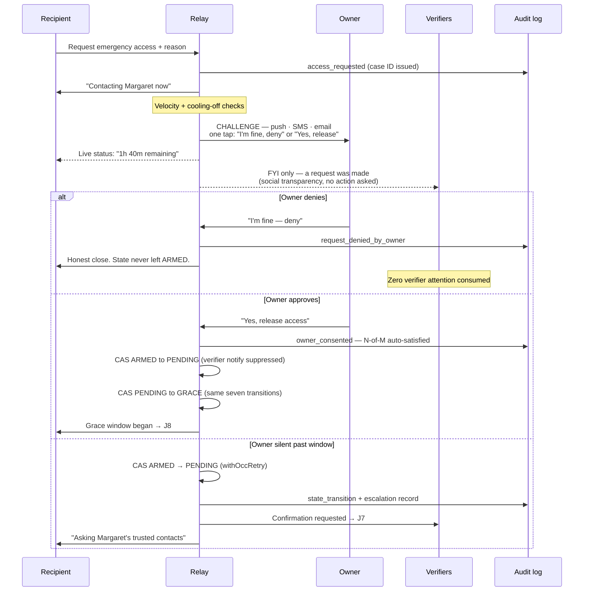

### Data flow

| Step | Reads | Writes |
|---|---|---|
| 1 | Recipient claimed identity | session |
| 2 | Velocity + cooling-off state | `access_requests` *(new)*: `recipient_id`, `owner_id`, `trigger_type`, `reason`, `evidence_ref`, `case_id`, `expires_at` |
| 3 | `users` contact channels | `notifications` (owner challenge, all channels) |
| 4a | — | `access_requests.status = denied_by_owner`; `release_state` **untouched, remains `armed`**; `audit_log` |
| 4b | `release_state` (strong read) | Two CAS steps `armed → pending → grace`, `version` incremented on each, `received_confirmations` set to `required_confirmations`, `grace_ends_at` set; `audit_log` records both transitions with the quorum auto-satisfaction marked owner-consented |
| 4c | `release_state` (strong read) | `release_state` CAS `armed → pending` through `withOccRetry`; **on exhaustion, `safeResetToArmed`** |
| 6 | `recipients`, `verifiers` | `notifications` (informational) |

### Requirements

- **J6-R1** A recipient SHALL be able to request access without an owner-issued link.
- **J6-R2** Every reversible-trigger request SHALL challenge the owner before notifying any verifier.
- **J6-R3** The owner challenge SHALL be delivered across all registered channels simultaneously and SHALL be actionable in one tap.
- **J6-R4** Owner denial SHALL close the request with `release_state` never leaving `armed`.
- **J6-R5** Owner approval SHALL advance the release to `GRACE` via the existing `ARMED → PENDING → GRACE` transitions, suppressing verifier notification and auto-satisfying N-of-M, with the auto-satisfaction recorded as owner-consented in the audit log. **No new state transition SHALL be added to `PERMITTED_TRANSITIONS`.**
- **J6-R6** Escalation to `PENDING` SHALL occur only after the owner-challenge window expires without response.
- **J6-R7** The challenge window SHALL be configurable per trigger type.
- **J6-R8** Requests SHALL be subject to velocity limits and a cooling-off period per recipient.
- **J6-R9** All recipients and verifiers SHALL be notified that a request was made, regardless of outcome.
- **J6-R10** The requesting recipient SHALL see accurate live status at all times, including time remaining.
- **J6-R11** Every request SHALL be assigned a case ID referenced in every subsequent notification to every actor (CC7).
- **J6-R12** An owner SHALL be able to stop a release from any channel at any point before it commits. **The stop is state-dependent and SHALL respect the permitted transitions:** from `PENDING` the release returns to `ARMED`; explicit `CANCELLED` is reachable only from `GRACE`. `PENDING → CANCELLED` is not a permitted transition and SHALL NOT be added.

> **J6-R9 is an anti-abuse control.** Broadcasting that a request occurred makes covert access
> attempts impossible, which is the deterrent that matters most in the family-dynamics context this
> product operates in.

---

## J7 — The verifier's moment

**Actor:** Verifier
**Trigger:** `release_state` entered `PENDING`; verifier notified.
**Success:** An accurate decision rendered in under two minutes, with no account creation.
**State:** `[GAP]` for the entire surface. `lib/auth/verifier-token.ts` and `/api/triggers/[id]/confirm` exist; **there is no verifier UI at all.**
**Business stake:** N-of-M verification is the moat (Build Spec §18, §25). It is also the least-built part of the system.

### The correctness gap this journey closes

**A verifier who can only confirm is a rubber stamp.**

`/api/triggers/[id]/confirm` has no deny path. A verifier who *knows* the request is illegitimate —
who just spoke to the owner, who knows the requester is estranged — has no way to say so. They can
only decline to act, which is indistinguishable from being on a plane.

This is not a UX shortfall. It is a correctness defect in the mechanism the product claims as its
moat. **Silence and objection must be distinguishable**, and a sufficient number of objections must
be able to halt a release.

The fix is additive: a `decision` column on `verifier_confirmations` (`confirm` | `deny` | `abstain`)
with `received_confirmations` counting only `confirm`, plus a `received_denials` counter on
`release_state`. Existing rows default to `confirm`, so current behavior and all existing tests are
preserved exactly.

### Happy path

| # | Step | State |
|---|---|---|
| 1 | Email/SMS carrying a **signed, single-use, short-TTL link**. No account, no app, no password. | token lib `[BUILT]`, delivery `[GAP]` |
| 2 | The page states everything needed for a real decision: **who** is asking, **for what**, **why now**, **what has already happened** ("Margaret has not responded to 3 contacts across 14 hours"), **what confirming does** ("Sarah gets view access to 34 items; Margaret can undo this at any time before 4:20pm"), and **what it does not do** ("you will not see any of Margaret's information"). | `[GAP]` |
| 3 | **Three actions: Confirm · Deny · I don't know.** Deny is as prominent and as easy as confirm. | `[GAP]` |
| 4 | **Confirm** → idempotent insert on `(release_state_id, verifier_id)` via OCC intent-read; `received_confirmations` incremented by CAS. Duplicate submissions are silently ignored. | `[BUILT]` |
| 5 | **Deny** → recorded. If denials make the threshold unreachable (`received_denials > M − N`), the release is **halted and returned to `ARMED`**; owner and recipient are both notified. | `[GAP]` |
| 6 | **I don't know** → abstain. Counts neither way, is recorded, and escalates to the next verifier or extends the window. | `[GAP]` |
| 7 | Threshold reached → `GRACE`. The grace window is the owner's final interrupt opportunity. | `[BUILT]` |
| 8 | **Closure message** — verifiers are volunteers doing an uncomfortable favour, and silence after the fact is why they stop answering: *"Thank you. Sarah now has access to what Margaret designated. Margaret can reverse this at any time."* | `[GAP]` |

### Process flow

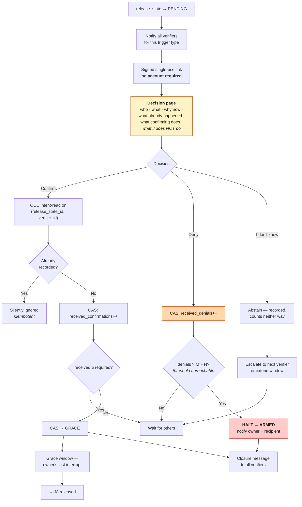

### Data flow

| Step | Reads | Writes | Boundary |
|---|---|---|---|
| 1 | `verifiers` for owner × trigger | `notifications` | Signed HS256 link, single-use, short TTL |
| 2 | `release_state` (strong read), `access_rules` **counts only**, escalation history | `audit_log` (`verifier_page_viewed`) | **Verifier sees counts and categories. Never titles, never ciphertext, never plaintext** (R6.8) |
| 4 | `verifier_confirmations` intent-read | `verifier_confirmations` (`decision='confirm'`), `release_state` CAS | 40001 → retry ×3 → treat as duplicate |
| 5 | `release_state` | `verifier_confirmations` (`decision='deny'`), `release_state.received_denials` CAS | Halt path uses `safeResetToArmed` |
| 7 | `release_state` | CAS `pending → grace`, `grace_ends_at` | Version increments on every transition |

### Requirements

- **J7-R1** *(amended twice on 2026-08-12, both ratified by Steve — supersedes "A verifier SHALL be
  able to render a decision without creating an account", then supersedes the first amendment's "a
  verifier who never enrolled SHALL still decide via a single-use code")* **No verifier SHALL be
  required to create an account, choose a password, or complete any enrolment step at decision
  time.** Enrolment happens in calm, as a standby account (`docs/standby-architecture.md` §3.3).
  A verifier who can already sign in SHALL decide from their standby dashboard and SHALL be sent no
  credential; a verifier who is confirmed but has no way to sign in SHALL be sent a single-use code.

  > **Why the wording changed the first time.** hybrid+6 ratified that a named contact *does* create
  > an account — as a standby, months before any emergency — so the original phrasing had become
  > false for the primary path while still being cited as authoritative. What it was protecting was
  > never account-lessness for its own sake: it was the absence of a signup wall between a verifier
  > and an urgent decision, the doctor mid-emergency being asked to pick a password. Moving
  > enrolment into calm serves that intent *better* than the original wording did.

  > **Why it changed again the same day.** The first amendment kept a promise the product could no
  > longer honour: *a verifier who never enrolled SHALL still decide via a single-use code*. Once
  > §4.3 quorum tightened to `confirmed`, an unenrolled verifier's answer is recorded and counts
  > towards nothing — so that sentence guaranteed the right to cast a vote with no effect, and it
  > was the **only** remaining reason to put a live credential into email for someone who did not
  > need one. Keeping a promise by mailing a credential that does nothing is the worst of both:
  > full risk, zero function.
  >
  > The guarantee that survives is the one that was always the point — **no enrolment at decision
  > time**. It now holds absolutely, for every class of verifier, because nobody is ever asked to
  > enrol in order to answer. What is no longer promised is that an unverified stranger can vote.
  >
  > The informational value that sentence was quietly carrying — *the owner learns that Dr Chen
  > says it is real* — is served where it belongs and where it is actionable: **to the owner, in
  > calm**, by `[A3]` readiness, which refuses to call a circle ready when the people in it cannot
  > act (`unsatisfiable_quorum`, `fragile_quorum`). An emergency is the wrong moment to discover it,
  > and an unverified person is the wrong messenger.
- **J7-R2** Verifier links SHALL be signed, single-use, and short-TTL. *(Applies to the unclaimed
  fallback. A verifier who can sign in receives no link and no code — they act from their standby
  dashboard, and there is nothing in the message to intercept.)*

  > **This requirement described the product before the product did it.** From the hybrid+6
  > ratification until 2026-08-12 the parenthetical said a claimed verifier receives no code while
  > `notifyVerifiersForTrigger` minted one for every verifier unconditionally. The spec was right
  > and the code was three sprints behind it; adaptive minting closed the gap. The wording is now
  > *can sign in* rather than *claimed*, because claiming is not what makes the code unnecessary —
  > holding a passkey or an authenticator is.
- **J7-R3** The decision page SHALL state who is asking, for what, why now, what has already been attempted, and precisely what confirming will and will not cause.
- **J7-R4** The page SHALL state explicitly that the verifier will never see vault contents.
- **J7-R5** The system SHALL support **confirm**, **deny**, and **abstain** as distinct recorded decisions.
- **J7-R6** Deny SHALL be presented with equal prominence and equal effort to confirm.
- **J7-R7** When recorded denials make the confirmation threshold unreachable, the release SHALL halt and return to `ARMED`, notifying owner and recipient.
- **J7-R8** Abstentions SHALL be recorded, SHALL count toward neither threshold, and SHALL trigger escalation to remaining verifiers.
- **J7-R9** A verifier SHALL contribute at most one decision per release instance. Duplicates SHALL be silently ignored without modifying counters.
- **J7-R10** Confirmation CAS conflicts (SQLSTATE 40001) SHALL retry with exponential backoff (base 100ms, max 3) before reporting failure.
- **J7-R11** Verifiers SHALL NEVER be granted read access to ciphertext or decrypted content.
- **J7-R12** All verifiers SHALL receive a closure message stating the outcome and the owner's ability to reverse it.
- **J7-R13** Verifier response rate and latency SHALL be measured per verifier. A consistently unresponsive verifier is a silent single point of failure and SHALL be surfaced to the owner during the J5 quarterly review.

---

## J8 — Hands on the account · **PRIMARY DEMAND USAGE**

**Actor:** Recipient
**Trigger:** `release_state` reached `RELEASED`.
**Success:** The top three urgent actions completed in the first session. No plaintext leak. Every access audited.
**Business stake:** This is the moment the product either works or does not. It happens on a phone, at 2am, to someone who has been crying. Everything else exists to make this moment good.

### The optimizations that define this journey

**1. Precompute the triage plan.** R13.7 budgets 15 seconds to generate the handoff plan at
`RELEASED`, with R13.8 defining a degraded fallback when that budget is missed. But the plan is
computed **entirely from non-secret metadata** — so there is no reason to compute it during the
crisis. Compute and cache it whenever the vault changes. The plan then renders instantly, and the
degraded-fallback path stops mattering.

**2. Ephemeral reveal.** A decrypted credential should never persist in the DOM or in client state.
Reveal is a momentary action paired with copy-to-clipboard and auto-clear.

**3. One next action, not a list.** A person in crisis cannot triage a list. The top card is a single
instruction: *"Start here: Margaret's Gmail. Everything else resets through it."*

**4. Shareable progress.** Siblings split this work. Progress persists per release so one recipient
can pick up where another stopped.

### Happy path

| # | Step | State |
|---|---|---|
| 1 | Recipient is notified and opens on **mobile**. Already authenticated from the J4 claim — no hunting for a token link in an email at 2am. | mobile `[P2]`, claim `[GAP]` |
| 2 | **Strongly-consistent read** of `release_state` before rendering anything. Token `version` must equal current `release_state.version`, or the request is blocked. | `[BUILT]` |
| 3 | **Precomputed triage plan renders instantly**: "Do today" / "This week" / "Within 30 days", dependency-ordered, root credentials always first regardless of score. | logic `[BUILT]`, precompute `[GAP]` |
| 4 | The top card is **one action**, not a list. | `[GAP]` |
| 5 | Reveal a secret → server verifies `RELEASED` **and** that `access_rules` covers this item → KMS unwrap → browser decrypts → plaintext rendered **ephemerally** with copy-and-clear. The audit entry is written **before** the work begins, with `detail.outcome` of `authorized` or `denied`. | `[BUILT]` + ephemeral `[GAP]` |
| 6 | Each step has a completion checkbox; progress persists and is visible to co-recipients. | `[GAP]` |
| 7 | Owner-authored annotations appear inline — *"the safe combination is in the blue folder"* — context no algorithm can produce. | `[BUILT]` |
| 8 | Regional failover mid-session is invisible: same OCC pattern, same retry policy, strongly-consistent reads from the secondary endpoint. | `[BUILT]` |
| 9 | Session is time-boxed to ≤24h. Re-authentication is one tap, never a re-claim. | `[BUILT]` + `[GAP]` |

### Process flow

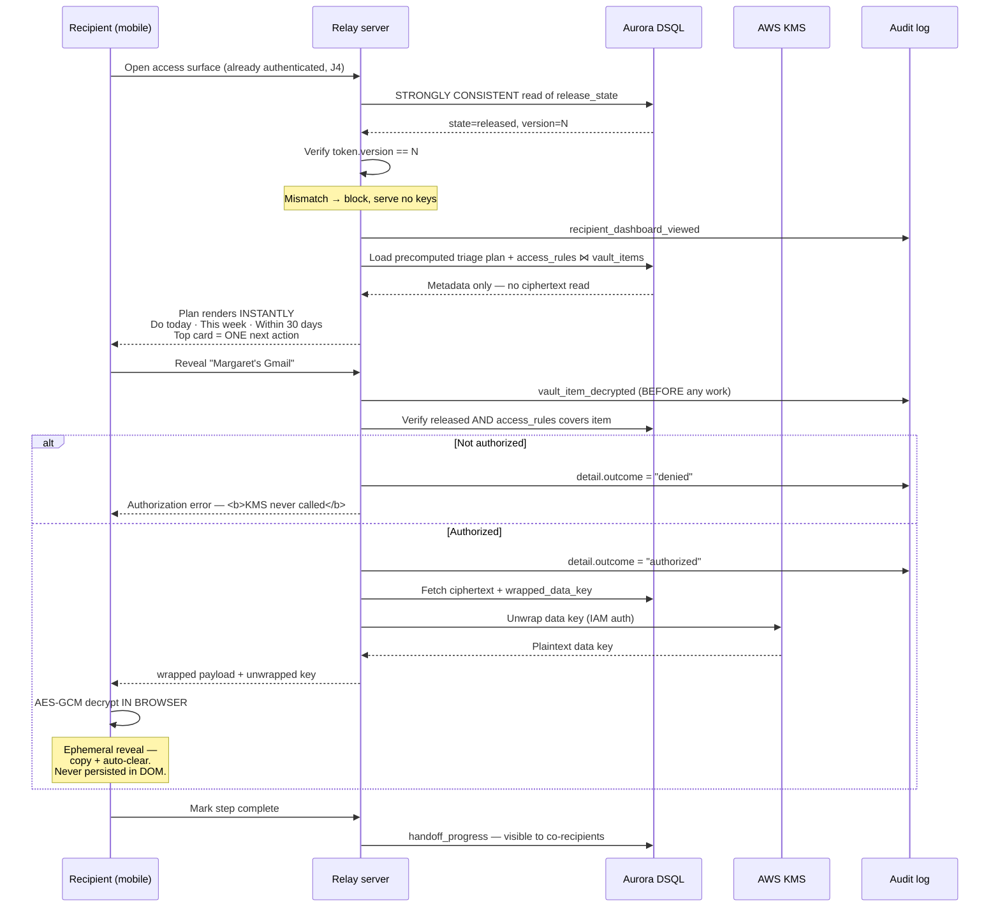

### Data flow

| Stage | Path | Boundary |
|---|---|---|
| Authorize | Recipient JWT (`release_state_id` + `version`) → strongly-consistent `release_state` read | Version mismatch blocks and serves no keys (R15.3) |
| List | `access_rules` ⋈ `vault_items` on covering index | Metadata returned without touching ciphertext columns |
| Plan | `triage_plans` cache *(new)*, computed on vault change | Metadata + titles only; never calls `kms:Decrypt` (R13.5) |
| Decrypt | `POST /api/access/[itemId]/decrypt` → verify `released` + `access_rules` → KMS unwrap | **KMS is not called if either check fails** (R7.5) |
| Render | Browser AES-GCM decrypt | Plaintext exists only in browser memory, ephemerally |
| Audit | Every view and every decrypt attempt | Written **before** the work; failures recorded with `outcome: denied` (R7.8) |
| Failover | `DSQL_USE_SECONDARY` / auto-rotate on primary error, 60s unhealthy window | Same CAS pattern, same retry policy, no logic change (R14.3) |

### Requirements

- **J8-R1** The recipient SHALL NOT need to locate, forward, or re-request a token link at access time.
- **J8-R2** Authorization SHALL use a strongly-consistent read of `release_state`. Cached reads SHALL NOT authorize.
- **J8-R3** A token whose `version` differs from the current `release_state.version` SHALL be rejected with no keys served.
- **J8-R4** The triage plan SHALL be precomputed on vault change and SHALL render without a generation delay at release.
- **J8-R5** Root credentials SHALL always rank first, followed by `importance_score` descending, ties broken alphabetically by title.
- **J8-R6** Plan ordering SHALL place an item's dependencies earlier in the sequence than the item itself.
- **J8-R7** The interface SHALL present a single next action above any list.
- **J8-R8** KMS SHALL NOT be called when either the release-state check or the access-rule check fails.
- **J8-R9** Decrypted plaintext SHALL be rendered ephemerally and SHALL NOT persist in the DOM or client state after the reveal ends.
- **J8-R10** An audit entry SHALL be written before decryption work begins, for authorized and denied attempts alike.
- **J8-R11** Any decryption failure SHALL surface a browser-visible error and SHALL prevent all plaintext exposure, including on partial failure.
- **J8-R12** Handoff progress SHALL persist per release and SHALL be visible to all recipients scoped to that release.
- **J8-R13** Owner annotations SHALL display inline with the step they annotate.
- **J8-R14** Regional failover SHALL NOT interrupt an in-progress session, and SHALL preserve every acknowledged committed write.
- **J8-R15** If both regional endpoints are unavailable, the system SHALL return HTTP 503 and SHALL NOT issue any write against `release_state` or dependent tables.
- **J8-R16** Recipient sessions SHALL expire no later than 24 hours after issuance.
- **J8-R17** The access surface SHALL meet CC8 accessibility requirements. This is the highest-stress surface in the product.

---

## J9 — Standing down · **THE DIFFERENTIATOR**

**Actor:** Owner + Recipient
**Trigger:** The owner recovers, returns, or the alarm was false.
**Success:** Access closes automatically and provably. The relationship survives. Both parties understand exactly what happened.
**Business stake:** **This is the capability no competitor has.** Everplans deputies, 1Password emergency kits, Bitwarden emergency access, Apple Legacy Contact — none of them close. This journey is the demo, the price justification, and the referral moment.

### The optimizations that define this journey

**1. The reversal receipt as a designed artifact.** The owner's first question on returning is
always the same: *"What did they see?"* An audit page they have to interpret is not an answer. A
receipt is: *"Sarah had access to 34 items for 6 hours and 12 minutes. She opened 4: your Gmail,
Chase checking, Blue Cross, and the pharmacy portal. She did not open the other 30."*
Hash-chain verifiable, exportable.

**2. A graceful close for the recipient.** The recipient just dropped everything and helped during a
crisis. Terminating their session with an authorization error is a way to lose a family
relationship. They deserve an explanation and a thank-you.

**3. The near-miss is the best gap-closing moment that will ever occur.** The owner has just
experienced, concretely, what their continuity plan does. Ask the one question that matters right
then: *"Sarah couldn't get into your pharmacy portal — it wasn't in the vault. Add it?"*

### Happy path

| # | Step | State |
|---|---|---|
| 1 | Owner checks in or explicitly cancels. | web `[BUILT]`, other channels `[GAP]` |
| 2 | CAS transition — `PENDING → ARMED`, `GRACE → ARMED`, `GRACE → CANCELLED`, or, when access was actually granted, **`RELEASED → ARMED`**. That last edge is the one that makes the reversibility claim true. **Estate is excluded — irreversible by design.** | `[BUILT]` |
| 3 | **Recipient tokens die immediately.** The JWT carries `version`; the version bump invalidates every issued token within 60 seconds. | `[BUILT]` |
| 4 | Recipient sees a **graceful close**, not an error: *"Margaret is back and has closed access. You had access to 34 items for 6 hours. Here's what you opened."* | `[GAP]` |
| 5 | Owner receives the **reversal receipt** — what was accessed, by whom, for how long — hash-chain verifiable and exportable. | audit `[BUILT]`, receipt `[GAP]` |
| 6 | Explicit **re-arm confirmation**: the system is `ARMED` again, and the owner is asked whether anything should change based on what just happened. | `[GAP]` |
| 7 | Owner can acknowledge or thank the recipient in one tap. **This is the referral moment** — both parties have just watched the product work. | `[GAP]` |

### State machine

The seven permitted transitions, verified against `lib/release/state-machine.ts`
(`PERMITTED_TRANSITIONS`). Any transition not in this set is rejected at the application layer
**before** a DB write is attempted.

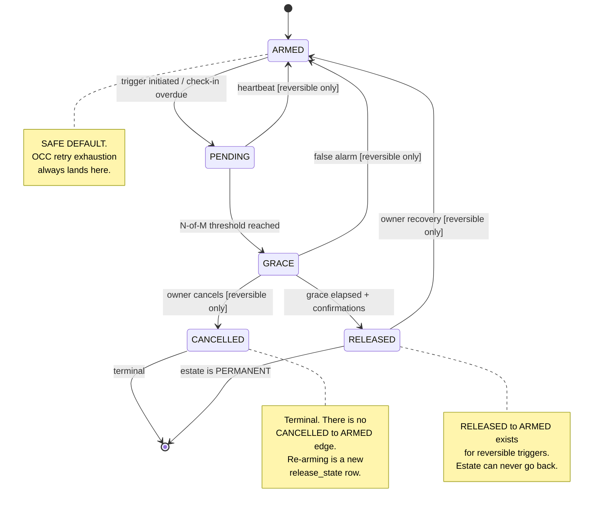

> **Two details worth stating precisely, because both are easy to get wrong:**
>
> **`CANCELLED` is terminal.** There is no `CANCELLED → ARMED` transition. Returning a cancelled
> trigger to service is not a state transition — it requires a new `release_state` row. Any UI
> offering "re-arm" after a cancel must be implemented that way.
>
> **`RELEASED → ARMED` is permitted for reversible triggers**, and it is the transition that makes
> the entire reversibility claim true. Note that `requirements.md` R5.2 enumerates only six
> transitions and **omits this one**, while `design.md`'s permitted-transition table and
> `PERMITTED_TRANSITIONS` in code both include it. The code and design doc are correct; **R5.2 is
> the stale artifact** and should be reconciled — a requirements document that omits the product's
> single most differentiating transition is a live trap for anyone implementing against it.

### Process flow

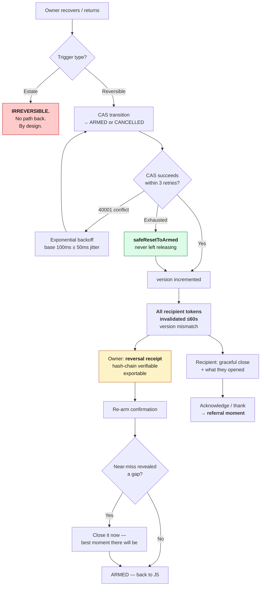

### Data flow

| Step | Reads | Writes |
|---|---|---|
| 1–2 | `release_state` (strong read). **Reversibility is derived from `release_state.trigger_type` via `isReversibleTrigger()` — i.e. any type except `estate`. It is *not* read from `access_rules.reversible`; the state machine never queries `access_rules` at all.** | `release_state` CAS `UPDATE ... WHERE id=$ AND state=$ AND version=$`, wrapped in `withOccRetry` |
| CAS failure | — | **`safeResetToArmed`** — the safe-default invariant (CC4) |
| 3 | `release_state.version` | Token invalidation is implicit: the JWT carries the old version and now mismatches |
| 5 | `audit_log` for the release window, ascending `seq` | Receipt artifact; chain verified client-side and server-side |
| 6 | Gap analysis over the release | `audit_log` |

**The invariant that matters most:** if OCC retries are exhausted, the row **must** end in `ARMED`.
A row left in a releasing state after an ambiguous outcome is the one failure this system cannot
have.

### Requirements

- **J9-R1** Reversal SHALL be available from any authenticated owner channel.
- **J9-R2** Reversal SHALL be rejected for `estate`, with an explicit error stating the release cannot be reversed.
- **J9-R3** All transitions SHALL use CAS checking both `state` and `version`.
- **J9-R4** OCC conflicts SHALL retry ≤3 times with exponential backoff and jitter, re-reading and re-evaluating before each attempt.
- **J9-R5** **On retry exhaustion the release row SHALL end in `ARMED`.**
- **J9-R6** All recipient sessions for a reversed release SHALL be invalidated within 60 seconds.
- **J9-R7** The recipient SHALL receive an explanatory close, not an authorization error.
- **J9-R8** The owner SHALL receive a reversal receipt naming what was accessed, by whom, and for how long.
- **J9-R9** The receipt SHALL be independently verifiable against the hash chain and SHALL be exportable.
- **J9-R10** The system SHALL confirm re-arm explicitly and SHALL prompt to close any gap the event revealed.
- **J9-R11** The audit log SHALL remain INSERT-only throughout. Reversal SHALL NOT delete or amend history.
- **J9-R12** Mean time from owner action to full token invalidation SHALL be measured and alarmed against the 60-second requirement.

---

## J10 — The permanent handoff

**Actor:** Executor (recipient with `role = 'executor'`)
**Trigger:** The owner has died.
**Success:** Verified, irreversible release; provider transitions completed; a legally defensible record.
**Business stake:** The highest willingness-to-pay moment in the product — the activation-fee revenue line (§24). Also the highest-risk: a false death release is unrecoverable.

> ### ⛔ Legal gate — binding
>
> **`g2-counsel-opinion` (owner: steve, due 2026-09-30) MUST clear before any paying estate customer.**
> Relay's fiduciary/custodian status under RUFADAA is unresolved. An adverse opinion routes this
> journey to B2B2C-through-regulated-partners only, or parks it. This journey may be *specified* now;
> it MUST NOT be sold before that opinion exists.

### The optimization that defines this journey

**Compose evidence to an assurance level; never trust a single signal.**

Death is the one trigger that cannot be undone, so its verification must be structurally stronger
than every other path — not by requiring more of the *same* evidence, but by requiring
*independent kinds*:

```
death certificate upload        (documentary)
      +
SSA Limited Access DMF / state EDR   (registry)
      +
N-of-M human verification, default 2-of-3   (social)
      +
mandatory waiting period            (temporal)
      ↓
   assurance level met → release
```

No single source releases an estate trigger. The waiting period exists specifically so that a living
owner has an opportunity to intervene even against otherwise-convincing documentary evidence.

### Happy path

| # | Step | State |
|---|---|---|
| 1 | Estate trigger initiated — by executor request, verifier report, or an automated death signal. | `[GAP]` / signals `[P2]` |
| 2 | **Graduated assurance composes evidence** across all four independent kinds. | `[P2]` |
| 3 | Owner challenge is attempted regardless — a living owner must always be able to stop this. Non-response is expected here, so the ladder is longer and weighted against the documentary evidence. | `[GAP]` |
| 4 | `GRACE` with a **long** window — days, not hours. The false-death case is catastrophic and irreversible; time is the cheapest possible safeguard. | config `[GAP]` |
| 5 | `RELEASED`, permanently. Estate can never transition back to any other state. | `[BUILT]` |
| 6 | Executor receives the estate-specific triage plan with **provider-specific guidance per item**: Apple Legacy Contact steps for Apple IDs, Google Inactive Account Manager for Google accounts, Meta memorialization for Meta accounts. | `[BUILT]` |
| 7 | **The executor packet** — a structured, exportable bundle: item inventory, owner directives, the complete hash-chained audit trail, and pre-filled provider submissions. Court-presentable and notarizable. | `[GAP]` |
| 8 | Provider transitions are executed where an API path exists, or submitted as structured packets where it does not. Each is tracked to completion, not merely described. | `[P2]` |
| 9 | Estate closure: final audit export, vault archived under the retention policy, subscription converted or terminated. | `[GAP]` |

### Process flow

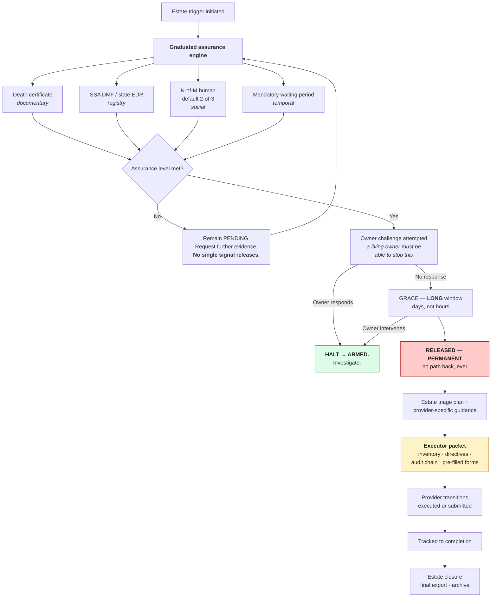

### Data flow

| Step | Reads | Writes | Boundary |
|---|---|---|---|
| 1–2 | `release_state` (strong read), `verifiers` | `evidence_artifacts` *(new)*: kind, source, hash, verified_at; `release_state.assurance_level` *(new)* | Death certificates contain PII — encrypted at rest under the same envelope scheme |
| 3–4 | `users` channels | `notifications`, `release_state` CAS → `grace` with extended `grace_ends_at` | Owner challenge always attempted |
| 5 | — | `release_state` CAS → `released`, `released_at`, `version` atomically incremented | **Estate `RELEASED` is terminal** (R5.10) |
| 6 | `getVaultMetadata()` + titles | `triage_plans` | Provider guidance is metadata-driven; never calls `kms:Decrypt` (R13.5) |
| 7 | `audit_log` full chain ascending `seq` | Packet artifact | Chain must verify end-to-end or the packet is not issued |

### Requirements

- **J10-R1** Estate release SHALL require evidence from multiple independent kinds. No single signal SHALL be sufficient.
- **J10-R2** Each trigger type SHALL carry a required assurance level, and the engine SHALL compose evidence until it is met.
- **J10-R3** An owner challenge SHALL be attempted for estate triggers regardless of documentary evidence strength.
- **J10-R4** Any owner response during an estate escalation SHALL halt the release and return the state to `ARMED` pending investigation.
- **J10-R5** The estate grace window SHALL be configurable in days and SHALL default materially longer than any reversible trigger.
- **J10-R6** An estate release SHALL NOT transition back to any other state once `RELEASED`.
- **J10-R7** The estate triage plan SHALL include provider-specific guidance for Apple, Google, and Meta account items.
- **J10-R8** The executor packet SHALL include item inventory, owner directives, the complete verified audit chain, and pre-filled provider submissions.
- **J10-R9** The packet SHALL NOT be issued if hash-chain verification fails.
- **J10-R10** Provider transitions SHALL be tracked to completion, not merely presented as instructions.
- **J10-R11** Evidence artifacts containing PII SHALL be encrypted under the same envelope scheme as vault items.
- **J10-R12** **This journey SHALL NOT be offered to a paying customer before `g2-counsel-opinion` is recorded.**

---

## Part V — Cross-journey optimization summary

The eight structural changes, consolidated:

| # | Optimization | Journeys | Replaces | Why |
|---|---|---|---|---|
| **O1** | Paywall behind the aha | J1 | Landing → interest form with no product between | Converts a claim into a demonstrated fact; measures WTP after value, which is what G1 is actually asking |
| **O2** | Policies over attributes, materializing into `access_rules` | J4, J2 | Up to 900 hand-authored per-item rows; new items silently uncovered | Removes the setup cliff and the staleness bug. **Additive — `access_rules` stays authoritative, no contract change.** Reconciliation on policy edit/delete is specified in J4-R14/R15 — a materializing layer without it would silently widen access |
| **O3** | Claim in calm, not in crisis | J4, J8 | Raw `?token=` link arriving at the worst moment | Removes all identity friction from the highest-stress moment; creates the referral relationship |
| **O4** | Verifiers can deny and abstain | J7 | Confirm-only API — a rubber stamp | **Correctness fix in the moat mechanism.** Silence and objection must be distinguishable |
| **O5** | Precompute the triage plan | J8 | 15s generation budget at `RELEASED` + degraded fallback | Metadata-only computation has no reason to run during a crisis. Removes the fallback path's relevance |
| **O6** | Passive-first liveness with an escalation ladder | J5, J6 | 30-day manual check-in ritual | False `PENDING` is the fastest way to destroy trust. Preserves scarce verifier attention |
| **O7** | Owner-challenge-first on every reversible trigger | J6 | Escalating every request straight to N-of-M | Short-circuits both the false-alarm case and the owner-is-conscious case before any verifier is contacted. Mitigates the §27 verification cold-start risk. **Implemented with the existing seven transitions — see J6-R5** |
| **O8** | Review by exception after import | J2 | A 300-row list the owner must triage | Surfaces ~20 consequential items and collapses ~280. Asking a human to review every row defeats the importance engine's entire purpose |

**None of the eight adds a state transition, changes a module contract, or moves an authorization
check.** O2 adds a layer above `access_rules`; O4 and O7 add columns and side effects around the
existing CAS path; O5 caches a computation that already exists. That is deliberate — the release
mechanism is the part of this system that is correct, and it should be the part that changes least.

---

## Part VI — Cross-cutting concern: owner account recovery

**Deliberately excluded from the ten journeys** — it is catastrophe-protection rather than
value-delivery, and it lost the tenth slot to the estate handoff. It is recorded here rather than
dropped, because it is genuinely important and, in the caregiver wedge specifically, **likely rather
than exceptional**: the owner is elderly, and device loss or authenticator confusion is a
high-probability event, not an edge case.

**The constraint.** Build Spec §20 commits to recovery without backdoors. A service-held master key
would solve recovery instantly and destroy the zero-knowledge claim that is the product's trust
spearhead. The stated direction is social-recovery shares and time-locked recovery quorums.

**The tension to resolve before this can be designed.** Recovery quorums and release quorums draw on
the same social graph. If the same three people can both *release* the vault to a recipient and
*restore* the owner's access, then the distinction between the two mechanisms is thinner than it
appears, and the recovery path becomes an alternate release path. Any design must either separate
those quorums or explicitly reason about why sharing them is safe.

**Interim requirement.** Until recovery is designed, owner authenticator enrolment MUST support
multiple factors and MUST prompt for a second factor at setup. An owner with exactly one
authenticator is one lost phone away from being locked out of their own continuity plan — which is,
with some irony, precisely the failure mode this product exists to prevent.

---

## Part VII — Data model deltas

Every delta below is **additive**. No existing table is repurposed, no existing column changes
meaning, and no module contract is altered.

| Table | Journey | Purpose | Notes |
|---|---|---|---|
| `subscriptions` | J1 | Entitlement, tier caps, price test cohort | Gated on G4 |
| `delegations` | J3 | `owner_id`, `delegate_user_id`, `scopes[]`, `consent_artifact_id`, `granted_at`, `revoked_at` | — |
| `consent_artifacts` | J3 | Method (`link` / `in_person` / `paper_upload`), timestamp, evidence ref | Retained for vault lifetime |
| `approvals` | J3 | Owner approval queue for delegate proposals | Nothing self-grants |
| `access_policies` | J4 | Attribute predicates that materialize into `access_rules` | **`access_rules` remains the sole authority for KMS unwrap** |
| `invitations` | J4 | Recipient and verifier claim flow | — |
| `identity_verifications` | J4 | KYC results at claim time | `[P2]` |
| `access_requests` | J6 | Recipient-initiated requests, challenge window, case ID | — |
| `notifications` | J5, J6, J7 | Delivery record per channel, itself audited | Supports CC9 |
| `triage_plans` | J8 | Precomputed plan cache, invalidated on vault change | Metadata only |
| `handoff_progress` | J8 | Per-release step completion, shared across co-recipients | — |
| `evidence_artifacts` | J10 | Death certificates, registry checks, assurance composition | Encrypted under envelope scheme |

**Additive columns:**

| Column | Table | Journey | Default preserves current behavior |
|---|---|---|---|
| `decision` | `verifier_confirmations` | J7 | `'confirm'` — existing rows and tests unchanged |
| `received_denials` | `release_state` | J7 | `0` |
| `assurance_level` | `release_state` | J10 | `null` |
| `created_by_delegate_id` | `vault_items` | J3 | `null` |
| `case_id` | `release_state` | CC7 | Generated |

All new tables inherit the existing DSQL constraints without exception: UUID primary keys, no foreign
keys (application-enforced via `assertOwns` / `assertNoCrossOwner` / `cascadeDelete`), OCC-safe writes
through `withOccRetry`, and an `owner_id` predicate on every query.

---

## Part VIII — Build state and sequencing

### Coverage

| Journey | Built | Gap | Phase 2 |
|---|---|---|---|
| J1 Acquisition | Landing, qualification, crypto, intake engine | Signup, seed, ZK moment, reveal framing, tier caps | Billing (G4) |
| J2 Cold-start | CSV import, dedup, encryption, scoring, risk graph, gaps | Review-by-exception, continuity-ready state | Document + email ingestion |
| J3 Assisted setup | Import mechanics only | **Entire delegation model** | — |
| J4 Circle of trust | Recipients, verifiers, rules, estate irreversibility, N-of-M | People unification, policies, coverage matrix, claim flow | Identity verification |
| J5 Living habit | Heartbeat, scheduler, reset, prioritization engine | Passive liveness, escalation ladder, review packaging, scheduler alarm | — |
| J6 Access request | State transitions, OCC | **Entire request + challenge flow** | — |
| J7 Verifier moment | Token lib, confirm API, idempotency, CAS | **Entire UI**, deny, abstain, halt, closure | — |
| J8 Hands on account | Auth, consistency, plan logic, decrypt, audit, failover | Precompute, single-action, ephemeral reveal, progress | Mobile |
| J9 Standing down | Full state machine, CAS, safe default, token invalidation | Receipt artifact, graceful close, re-arm prompt | — |
| J10 Estate | Irreversibility, provider guidance, audit chain | Executor packet, long grace, closure | Death signals, RON, **G2** |

### Sequencing against the gates

`PROJECT.yaml` carries a binding rule: **no further building until G1 produces evidence.** These
journeys do not override it. The correct order:

1. **G1 first.** Ship only what J1 needs to measure willingness-to-pay properly: signup, seed,
   reveal, price, and a *verified-firing* instrument (J1-R10). Everything else waits.
2. **On G1 pass** — J4's claim flow and J3's delegation, because they are what make the wedge
   actually usable, then J7's verifier surface, which is the largest correctness gap.
3. **G2 before any estate work reaches a paying customer.** J10 may be specified; it may not be sold.
4. **J8 and J9 polish continuously** — they are largely built, and the optimizations are refinements
   rather than new systems.

### Open decisions

| # | Decision | Owner |
|---|---|---|
| 1 | Price point for the G1 test — at, above, or below the $99.99/yr Everplans anchor | Steve |
| 2 | Free-tier caps: 10 items / 1 recipient as specified, or different | Steve |
| 3 | Whether the delegate model (J3) needs its own counsel review alongside G2 — the elder-abuse surface is a distinct legal question from RUFADAA custodianship | Steve |
| 4 | Whether recovery and release quorums may share a social graph (Part VI) | Design |
| 5 | Owner-challenge window per trigger type — 2h for emergency is a starting proposal, not evidence | Design |

---

*Journey set and optimizations ratified by Steve, 2026-08-06.*
