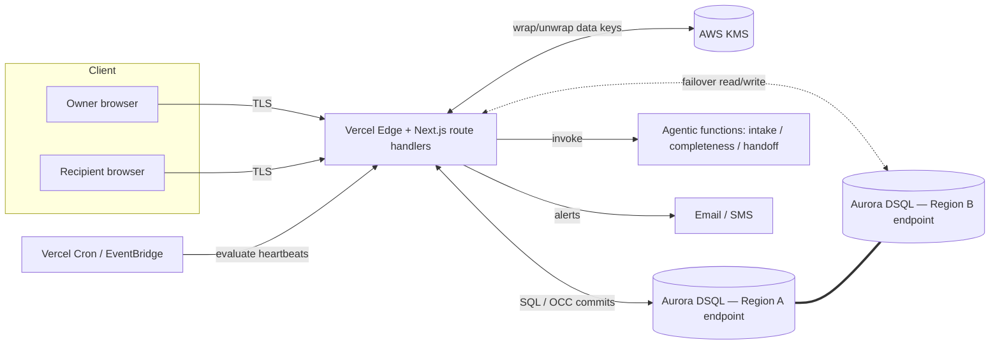

# Relay — H0 Build Spec (v2)

*Standby access for the people who'll need it — when you can't be there.*

**Hackathon:** H0: Hack the Zero Stack with Vercel v0 and AWS Databases
**Deadline:** June 29, 2026 @ 5:00pm PDT (build window: ~12 days)
**Prize pool:** $80,000 cash + $80,000 AWS credits

---

## 0. Decision record — what changed from v1 (HeirKey)

| Decision | v1 | v2 (locked) |
|---|---|---|
| Positioning | Death / inheritance vault | **Continuity & emergency access**; inheritance is one trigger, not the whole product |
| Name | HeirKey | **Relay** (working name) |
| Hero demo | "Maria dies" | **Recoverable emergency** (injury → emergency access → recovery → re-lock) |
| Scale proof | Claimed (DSQL active-active) | **Demonstrated live region failover** in the video |
| Release transition | Implicit state change | **Explicit compare-and-set under OCC** (handles 40001 retries) |
| Referential integrity | Implied FKs | **Enforced in app logic** — DSQL does not enforce foreign keys |
| Verification | Hand-waved grace/verifier | **First-class N-of-M verification subsystem** with reversible grace + tamper-evident audit |
| Crypto | Envelope (KMS) | Envelope (KMS) for MVP; **threshold secret-sharing as gated day-8 stretch** |
| Monetization | Consumer sub | **Embedded continuity infrastructure** (B2B2C-led); consumer is the on-ramp, trusted institutions are the scale path |
| AI | Central | **Lightweight importance engine** (metadata-only, heuristics + LLM); meaningful but not the hero — the DB stays primary |
| Two-DB flourish | Optional DynamoDB | **Cut** — single hero DB scores better |

---

## 1. Snapshot

| | |
|---|---|
| **Name** | Relay (alternates: Continuum, Standby, Keystone) |
| **Track** | Track 1 — Monetizable B2C (consumer demo; commercial scale path is embedded B2B2C infrastructure — §24) |
| **Hero database** | Amazon Aurora DSQL (multi-region active-active) |
| **Frontend** | Next.js scaffolded in v0.app, deployed on Vercel |
| **Crypto** | Client-side envelope encryption via AWS KMS (MVP); threshold secret-sharing (stretch) |
| **One-liner** | "Set up standby access to everything that matters, so the right person can get in the moment you can't — a hospital stay, a trip, an emergency, or one day, your estate." |

---

## 2. Product thesis & positioning

### 2.1 The pivot

The digital-legacy category fails on adoption because people avoid planning for death, so the value sits decades away and engagement is near-zero. Relay sells **living continuity**: trusted standby access that pays off repeatedly, across ordinary and emergency life events. Inheritance is simply the final, most permanent trigger of the same mechanism.

### 2.2 Trigger types (one mechanism, many occasions)

- **Emergency / incapacity** — owner is in surgery, hospitalized, or unreachable; a designated person gets scoped access *now*, reversibly.
- **Travel / standby** — owner pre-arms limited access for a defined window.
- **Caregiver** — ongoing scoped access for an aging parent's affairs.
- **Business continuity** — ops/cofounder can reach critical systems if the principal is unavailable.
- **Estate / death** — the permanent handoff (verified, irreversible).

All five route through the **same release state machine and verification subsystem.** Only the trigger conditions, scope, and reversibility differ.

### 2.3 Users

- **Owner** — organizes accounts, documents, credentials, instructions; assigns scoped access to recipients under rules.
- **Recipient** — spouse, adult child, executor, business partner, caregiver. Receives scoped, guided access on a verified trigger.
- **Verifier** — a trusted party who confirms a trigger condition (can overlap with recipients; modeled separately for N-of-M).
- **Channel partner (B2B2C)** — wealth manager / estate attorney / insurer who distributes Relay to their clients (post-MVP, but stated in pitch).

### 2.4 Hard constraints

Relay never bypasses platform security or "breaks in." It orchestrates the legitimate path. The **secure core never stores plaintext secrets at rest** — secrets are encrypted client-side (§9). Convenience ingestion tiers that must process plaintext server-side (e.g., financial aggregation) are a clearly-labeled, opt-in exception outside the secure core (§10.5). Full zero-knowledge — where even Relay cannot read the data — is the threshold-crypto direction (§9.3, §20). Access is gated on verified triggers and is reversible until a permanent (estate) release commits.

---

## 3. Why this wins H0 (criteria alignment)

- **Technological Implementation** — DSQL is load-bearing and used *natively*: the irreversible release is a compare-and-set validated by OCC; referential integrity is enforced in app logic because DSQL has no foreign keys; multi-region active-active is **demonstrated** via live failover. This is craftsmanship in the panel's own domain.
- **Design** — two deliberate emotional modes (calm "organizer" while well; focused, reassuring "access" mode under stress), designed in relation to the release state machine.
- **Impact & Real-world Applicability** — solves recurring living problems, not a hypothetical future one; shippable; monetizable; the verification subsystem answers the "how do you know they're authorized" question head-on.
- **Originality** — most entrants will ship CRUD storefronts or morbid vaults. A continuity primitive whose architecture is justified by "verified, reversible, strongly-consistent, globally-available access handoff" is a rare story told to the people who own the database.

**Side-award targeting.** Beyond a track placement, engineer the submission to win **Best Technical Implementation** ($2K) — the DSQL-native correctness story (OCC compare-and-set + live failover + no-FK referential integrity) is purpose-built for it, and side awards are judged across all tracks and are typically less crowded than a track first-place. **Best Design** (the two emotional modes) and **Most Impactful** are secondary targets. This roughly doubles the shots on goal for near-zero added work — so foreground the technical story in the architecture diagram and submission text.

---

## 4. Functional requirements (MoSCoW)

**Must**
- FR1. Owner can create an encrypted vault and add items (login, account, document, note, instruction).
- FR2. Each item is encrypted client-side; server stores ciphertext + non-sensitive metadata only.
- FR3. Owner can define recipients and assign per-item access rules (scope + trigger + reversibility).
- FR4. Owner sets a heartbeat/check-in cadence; missed check-ins can initiate a trigger.
- FR5. A trigger moves the owner's `release_state` through ARMED → PENDING → GRACE → RELEASED via OCC-validated compare-and-set; owner can interrupt during GRACE (reversible triggers).
- FR6. N-of-M verifiers must confirm a trigger before RELEASED (configurable threshold per trigger type).
- FR7. Recipient, once released, sees only the items their rules grant, in an access dashboard.
- FR8. Every state change and access event is written to an append-only, tamper-evident audit log.
- FR9. "Simulate trigger" control for the demo (fast-forwards the state machine).
- FR17. Bulk ingest accounts from a password-manager / browser CSV export, parsed and encrypted client-side — the cold-start defeat. Manual entry remains the universal fallback. (See §10.5.)

**Should**
- FR10. Recipient access dashboard is a *sequenced, dependency-aware, importance-ranked* plan (e.g., reroute autopay before closing the bank account), not a flat list.
- FR11. Document/import extraction with AI classification **and importance scoring** — sets category, `is_root_credential`, `recurring_billing`, `irreplaceable`, and base `importance_score`.
- FR12. **Prioritized** gap detection — rank missing fields (recovery email, 2FA notes, beneficiary, "what this is for") by consequence, not just presence; flag irreplaceable items as custody candidates.
- FR13. Provider-specific guidance generation for estate triggers (Apple Legacy Contact, Google Inactive Account Manager, Meta memorialization).

**Could**
- FR14. Threshold secret-sharing so the service cannot decrypt even at release (see §9.3).
- FR15. Multi-region failover demonstrated in-product (read/write continues against a second regional endpoint).
- FR16. Channel-partner / white-label org model.
- FR18. Financial-account discovery via aggregation (Plaid sandbox) — accounts enumerated and added with one consented connection. (See §10.5.)

**Won't (this hackathon)**
- Real death-certificate verification integrations; full RUFADAA per-state compliance engine; native provider API integrations; mobile apps.
- Live social-media API ingestion and inbox-scanning account discovery — deferred to Phase 2, with live social APIs ruled out entirely in favor of data-export ingestion (see §10.5 and §21).

---

## 5. Non-functional requirements

- **NFR1 Availability** — the release/access path must survive a single-region outage. Target the DSQL multi-region active-active posture (five-nines multi-region SLA) and prove it in the demo.
- **NFR2 Consistency** — the RELEASED transition and all post-release authorization reads must be strongly consistent. No stale read may show wrong recipient scope or release state.
- **NFR3 Confidentiality** — zero plaintext secrets at rest server-side. KMS-wrapped data keys; ciphertext-only persistence. (Stretch: service cannot decrypt at all.)
- **NFR4 Integrity / auditability** — append-only audit log with hash-chaining so tampering is detectable.
- **NFR5 Reversibility** — non-estate triggers are interruptible by the owner during GRACE; the system defaults to the safe (locked) state on ambiguity.
- **NFR6 Least privilege** — recipients receive the minimum scope their rules define; verifiers can confirm but never read vault contents.
- **NFR7 Concurrency correctness** — all multi-actor transitions are written as OCC-safe compare-and-set with retry/backoff on SQLSTATE 40001; the system aborts safely rather than double-releasing.
- **NFR8 Privacy** — verifiers and partners see only what they need; no cross-owner data joins.
- **NFR9 Assistive, ZK-preserving AI** — the importance engine operates on non-secret metadata only (never decrypted secrets), so it preserves zero-knowledge; all importance output is shown with reasoning and is owner-overridable, never silently authoritative.

---

## 6. System architecture

### 6.1 Components

- **Web app (Next.js on Vercel, scaffolded in v0)** — owner and recipient UIs; route handlers as the API.
- **Crypto boundary (browser/edge + AWS KMS)** — envelope encryption; plaintext never leaves the client unencrypted; KMS wraps/unwraps data keys.
- **Aurora DSQL (multi-region active-active)** — system of record: vault metadata + ciphertext, rules, recipients, verifiers, release state, audit log.
- **Scheduler (Vercel Cron or EventBridge)** — evaluates heartbeats; advances state machine; sends notifications.
- **Ingestion (client-side)** — CSV/password-manager import and document parsing run in the client and encrypt before upload, keeping the secure core zero-knowledge-compatible (§10.5).
- **Agentic functions (serverless)** — the importance engine: classify/score, prioritize gaps, triage the handoff plan; operates on non-secret metadata only (§10).
- **Notification service** — email/SMS for check-in nudges, trigger alerts, verifier requests.

### 6.2 Reference architecture (source for the required H0 diagram)



The `D1 === D2` link is the headline: DSQL keeps both regional endpoints strongly consistent and active-active. The demo cuts D1 and shows continuity from D2.

### 6.3 Multi-region failover demo (FR15 / NFR1)

Provision DSQL across two regions. The app reads/writes a regional endpoint. In the demo, simulate a region loss (drop/disable the D1 endpoint connection) and show the recipient's access path continuing from D2 with consistent state. **Validate the exact endpoint and failover mechanics during the build** — DSQL is evolving; confirm the current behavior of regional endpoints and how clients should target/retry them.

---

## 7. Data model (DSQL-correct)

**DSQL realities baked in:** primary keys determine physical layout and write distribution; indexes are key-ordered and benefit from covering columns; **foreign keys are not enforced** — referential integrity lives in application logic; concurrency is OCC with snapshot isolation. Model accordingly: UUID PKs, explicit reference columns, app-level existence/cascade checks, and per-owner secondary indexes.

```
users
  id UUID PK, email, auth_sub, status,
  last_active_at, checkin_interval_days, created_at
  -- index on (auth_sub), (email)

recipients
  id UUID PK, owner_id UUID, name, relationship,
  email, phone, role [recipient|executor|caregiver|partner],
  created_at
  -- index on (owner_id)

verifiers
  id UUID PK, owner_id UUID, name, contact,
  verification_status, created_at
  -- index on (owner_id)

vault_items
  id UUID PK, owner_id UUID, type [login|account|document|note|instruction],
  title, service_name, url, category, criticality,
  -- importance-engine metadata (non-secret; read by §10, ZK-preserving) --
  is_root_credential BOOL,        -- email/phone/password-manager: unlocks other accounts
  recurring_billing BOOL,         -- money moves in/out → high consequence
  irreplaceable BOOL,             -- can't be regenerated → custody candidate (Decision A, §10.5)
  importance_score NUMERIC,       -- base score; contextual score (trigger×recipient) computed at read
  depends_on_item_id UUID NULL,   -- edge in the risk graph (root → dependents); drives FR10 sequencing
  -- secrets --
  ciphertext, wrapped_data_key, kms_key_id,
  created_at, updated_at
  -- index on (owner_id), covering (title, category, criticality, importance_score)

access_rules
  id UUID PK, owner_id UUID, vault_item_id UUID, recipient_id UUID,
  trigger_type [emergency|travel|caregiver|business|estate],
  scope [view|act], reversible BOOL,
  release_after_days INT, created_at
  -- index on (owner_id), (vault_item_id)

release_state            -- one active row per (owner_id, trigger_type)
  id UUID PK, owner_id UUID, trigger_type,
  state [armed|pending|grace|released|cancelled],
  required_confirmations INT,        -- the N in N-of-M
  received_confirmations INT,
  version BIGINT,                    -- CAS guard for OCC (see §8.2)
  initiated_by, initiated_at, grace_ends_at, released_at
  -- index on (owner_id, trigger_type)

verifier_confirmations
  id UUID PK, release_state_id UUID, verifier_id UUID,
  confirmed_at, method [app|document|manual]
  -- app-enforced uniqueness on (release_state_id, verifier_id)

audit_log                -- append-only, hash-chained (NFR4)
  id UUID PK, owner_id UUID, seq BIGINT,
  actor, action, entity, entity_id, detail,
  prev_hash, entry_hash, ts
```

**App-level referential integrity:** on insert/delete, validate referenced rows exist within the transaction; on owner/recipient deletion, cascade in application logic. Where a uniqueness or parent-exists guarantee matters under concurrency, use the OCC pattern (intent read + commit-time conflict detection) rather than relying on a constraint DSQL won't enforce.

**Audit integrity:** `entry_hash = H(prev_hash ‖ canonical(entry))`. A monotonic `seq` per owner plus the hash chain makes deletion or reordering detectable.

---

## 8. Release & verification subsystem (the heart)

### 8.1 State machine

```
ARMED ──(heartbeat missed OR manual emergency)──▶ PENDING
PENDING ──(notify owner; required confirmations not yet met)──▶ GRACE
GRACE ──(owner re-checks-in, reversible trigger)──▶ ARMED        // false alarm
GRACE ──(received_confirmations ≥ required AND grace elapsed)──▶ RELEASED
ANY ──(owner cancels, reversible trigger)──▶ CANCELLED
```

Estate triggers are non-reversible once RELEASED; all others remain interruptible during GRACE (NFR5). Default-safe: any ambiguity holds the locked state.

### 8.2 OCC-safe transition (NFR7) — the signature technical detail

Every transition is a compare-and-set guarded by `version`, committed under DSQL's optimistic concurrency. Concurrent actors (owner re-checking in, a verifier confirming, the cron advancing the clock) cannot double-release: one commit wins, the conflicting one receives SQLSTATE **40001** and is retried or safely aborted.

```sql
-- advance only if state and version match what we read
UPDATE release_state
   SET state = :next_state,
       received_confirmations = :recv,
       version = version + 1,
       grace_ends_at = :grace_ends_at
 WHERE id = :id
   AND version = :expected_version
   AND state = :expected_state;
-- on COMMIT: success, or 40001 -> exponential backoff + jitter, re-read, re-evaluate
```

**Why DSQL fits this workload:** OCC degrades under high contention, but a personal continuity vault is intrinsically *low-contention* — a single owner, rare release events, a handful of verifiers. This is precisely the regime where OCC shines, so the database's defining tradeoff is an asset here, not a liability. Say this to the judges.

### 8.3 N-of-M verification (FR6)

Each trigger type carries `required_confirmations`. Verifiers confirm independently; confirmations are idempotent (app-enforced uniqueness per verifier per release). RELEASED requires confirmations ≥ threshold **and** grace elapsed. Verifiers can attest to a condition but are never granted read access to vault contents (NFR6). This graduated, multi-party model is both the credibility answer for judges and the trust moat for the market.

### 8.4 Heartbeat

Cron evaluates `last_active_at` vs `checkin_interval_days`. Crossing the window initiates PENDING for the configured trigger and notifies the owner. Owner activity or explicit check-in resets the clock and (for reversible triggers in GRACE) returns to ARMED.

---

## 9. Security & cryptography

### 9.1 MVP — client-side envelope encryption (NFR3)

- Each vault item is encrypted in the client with a per-item data key (AES-GCM).
- Data keys are generated/wrapped by **AWS KMS**; only `wrapped_data_key` + `ciphertext` + `kms_key_id` are persisted.
- The DB never holds plaintext secrets. At release, an authorized, verified recipient session is permitted to unwrap only the data keys for items their rules grant.

This yields a clean "zero plaintext at rest" story and avoids depending on DSQL crypto extensions.

### 9.2 Known residual trust gap (be honest about it)

In the MVP, the service *can* technically unwrap on a recipient's behalf, so it is trusted-not-to-read rather than unable-to-read. §9.3 closes that gap and is the differentiator — but only if core is solid.

### 9.3 Stretch (gated to day 8) — threshold secret-sharing (FR14)

Split each item's key (or a vault master key) with Shamir-style secret sharing so reconstruction requires the trigger condition to be met: e.g., the recipient's share **plus** an escrow share released only when `release_state = RELEASED` and verification threshold is met. The service alone cannot reconstruct the key. This is the cryptographic moat ("even we can't read it; access is mathematically gated on a verified trigger") and a strong Most-Original / Best-Technical hook.

**Gate:** attempt only if the continuity flow + failover demo are solid by ~day 8. A working envelope-encryption MVP beats a broken threshold-crypto demo every time.

### 9.4 Authn/z

Email + MFA for owners; scoped, time-boxed recipient sessions issued only after RELEASED; IAM-based auth to DSQL from the backend; least-privilege KMS key policies.

---

## 10. Agentic AI layer — the importance engine

The AI layer's job is not classification for its own sake; it turns a large, flat, imported inventory into a focused, prioritized one — solving the cold-start *and* over-population problems together. Three serverless agents, all operating on **non-secret metadata** (category, URL, flags), never on decrypted secrets — so the smartest part of the product never breaches zero-knowledge (you don't need the password to know something is the primary bank login). All output is **assistive, not authoritative** (NFR9): importance is shown with its reasoning and is always owner-overridable, because in a consequential domain a silently mis-ranked account is a real harm.

**Importance is contextual** — a function of *trigger type × recipient × consequence-of-absence*, not a single tag. What a spouse needs in an emergency differs from what an executor needs at death, so the engine ranks per context.

**The vault is a risk graph, not a list.** Root credentials — primary email, phone, the password manager — unlock other accounts via password reset, so importance is partly graph-centrality: items that gate the most dependents rank highest. The engine infers these edges (`depends_on_item_id`) and can tell a recipient, "you can't do anything until you're into this one email — it gates 40 resets."

1. **Intake agent (FR11)** — parses uploads/imports to extract service name and type, auto-categorizes, and **scores**: sets `is_root_credential`, `recurring_billing`, `irreplaceable`, and a base `importance_score`. Turns a raw 300-row CSV into a structured, ranked inventory.
2. **Prioritization agent (FR12)** — ranks gaps by *consequence*, not presence ("your highest-consequence account has no recovery note and no recipient — fix this first"), and flags `irreplaceable` items as custody candidates, making the §10.5 Decision A per-item.
3. **Triage / handoff agent (FR10/FR13)** — at release, produces a time-ordered plan from importance × dependency order ("Day 1: these three; this week: these seven"), and for estate triggers emits the provider-specific path and executor packet.

**MVP vs. commercial:** for the hackathon this is LLM-reasoning + heuristics over metadata (classify, score, infer edges, plan). The learned learning-to-rank model — trained on labeled importance plus a feedback loop of which items recipients actually used — is a Phase 2 data-science build and a genuine data moat (§17).

---

## 10.5 Data ingestion & population

*How the vault gets populated is the make-or-break question for a vault product — the empty-vault cold start is the category's primary churn driver. Ingestion is a first-class subsystem, not a feature. Two decisions below (A and B) are tradeoffs worth making deliberately rather than by default.*

### Decision A — Index vs. custody (what Relay stores)

| Model | What it holds | Pros | Cons |
|---|---|---|---|
| **Index / orchestration** | References, credentials, access instructions, small critical docs | Cheap; privacy-preserving; legally clean; composes with zero-knowledge; small breach surface | Useless if the source account is deleted before the recipient acts; doesn't preserve content |
| **Custody / archive** | Actual copies (files, photos, posts) | True snapshot survives account deletion; recipient gets the asset, not a treasure hunt | Storage cost at scale; ToS exposure for re-hosting platform content; far larger breach surface; heavier legal footprint |

**Recommended default: index-primary, with optional *selective* custody** for a curated set of irreplaceable items (key documents, one photo album). For continuity, the recipient mostly needs *access while accounts are still live* plus *copies of the few things that could vanish*. Pure custody of everything is a cost-and-legal trap; pure index fails on deletion. The hybrid bounds both. **Tradeoff to weigh:** more custody = more user value and stickiness, but more cost, liability, and breach surface. Start narrow; let the *owner* choose which items to snapshot.

### Decision B — Manual vs. automated (how data gets in)

| Approach | Pros | Cons |
|---|---|---|
| **Manual entry** | Zero integration risk; no ToS/API fragility; legally clean; full consent; covers the long tail no API reaches; forces curation | Cold-start abandonment; incomplete (you forget accounts); goes stale; high friction = low conversion |
| **Automated ingestion** | Defeats cold start; breadth in minutes; stays current with sync | Integration cost; API/policy fragility; privacy-scope burden; can over-populate with noise |

**Recommended posture: automate for breadth, curate for what matters, sync for freshness.** Manual-only is fine for the hackathon *demo* but is the documented churn killer commercially. The nuance worth keeping: for a *continuity* product, **curation is a feature, not a failure** — the recipient needs the 30 accounts that matter with instructions and priority, not all 300. So the flow is: bulk-import to defeat the blank screen → Completeness agent helps prune and annotate the critical set → lightweight ongoing capture prevents staleness.

### Ingestion methods (tiered)

| Method | Populates | Pros | Cons | ZK-safe? | Phase |
|---|---|---|---|---|---|
| Manual entry | Anything | Universal backstop | Tedious; partial; stale | Yes (client-side) | MVP |
| **Password-manager / browser CSV import** | Account names, URLs, usernames, often creds | Defeats cold start in one step; meets users where data is; trivial build | Quality varies by source; needs dedup | Yes if parsed client-side | **MVP (hero)** |
| Document upload + AI extraction | Accounts/assets named in statements, wills, IDs | Captures the paper trail; already specced | Needs review; OCR edge cases | Yes if parsed client-side | MVP |
| Financial aggregation (Plaid / MX) | Banks, brokerages, cards | Reliable enumeration of the highest-value slice; mature | Server-side data flow; per-connection cost | **No** (aggregator sees data) | MVP stretch / Phase 2 |
| OAuth discovery from email signals | Inferred accounts from signup/receipt mail | High coverage; low user effort | Gmail read is a *restricted scope* needing a security assessment; privacy-heavy | Hard (server-side scan) | Phase 2 |
| Cloud-storage connectors (Drive/OneDrive/Dropbox) | File listings; optional custody | Real asset reach; APIs exist | iCloud has no general API; custody cost | Hard unless client-side | Phase 2 |
| **Social-media data** | Posts, photos, connections | — | **Live third-party APIs to personal accounts are effectively closed** (Instagram Basic Display ended Dec 2024; X/Reddit/Meta gated or priced out); scraping violates ToS | n/a | Phase 2 — **via data-export archive only** |
| Browser extension / mobile capture | Accounts as you log in | Keeps vault fresh continuously | Real build; platform restrictions | Yes (client-side) | Phase 2 |

For social specifically: do **not** plan live API ingestion of personal accounts — that path has closed industry-wide. The durable design is ingesting the user's own **official data-export archive** (Facebook "Download Your Information," Instagram download, Google Takeout, X archive, LinkedIn export): ToS-clean, user-consented, and immune to API policy churn because it uses no API.

### The zero-knowledge boundary (cross-cutting constraint)

This is the constraint that quietly governs the whole subsystem and conflicts with §9.3: **any server-side automated ingestion (inbox scan, Drive copy, aggregator) means Relay's servers touch plaintext, breaking "we can't read your data."** Preserving zero-knowledge forces ingestion to run **client-side** — the browser/app does the OAuth and parsing, encrypts, and uploads only ciphertext — which is harder to engineer and rules some methods out as "easy." Pick the boundary deliberately: CSV import, document parsing, and capture can be client-side (ZK-safe); aggregation and inbox discovery are inherently server-side (ZK-relaxed). A defensible commercial answer is a **two-tier trust model**: ZK-safe methods for the sensitive core, clearly-labeled ZK-relaxed methods for convenience data, with the owner told which is which.

### MVP recommendation

Manual entry + document-upload extraction (already specced) + **CSV/password-manager import as the hero ingestion path** (client-side parse + encrypt) — this alone makes the demo land ("import → 80 accounts populate → curate the dozen that matter"). Plaid sandbox is a day-9 stretch if the demo needs more flash. Everything else is Phase 2 (§21).

---

## 11. API surface (representative)

```
POST   /api/vault/items            create/encrypt item (ciphertext in)
GET    /api/vault/items            list owner items (metadata only)
PUT    /api/vault/items/:id        update item
POST   /api/import                 ingest client-parsed CSV / password-manager export (ciphertext items)
POST   /api/recipients             create recipient
POST   /api/verifiers              create verifier
POST   /api/rules                  create access rule
PUT    /api/checkin                owner heartbeat / reset clock
POST   /api/triggers/:type/initiate    start a trigger (manual emergency)
POST   /api/triggers/:id/confirm       verifier confirmation (idempotent)
POST   /api/triggers/:id/cancel        owner interrupt (reversible)
GET    /api/access                  recipient: granted items (post-RELEASED only)
GET    /api/audit                   owner: hash-chained audit log
POST   /api/demo/simulate           fast-forward state machine (demo only)
```

All state-mutating trigger endpoints use the §8.2 OCC compare-and-set with retry.

---

## 12. Frontend / v0 build plan

Scaffold in v0.app, deploy on Vercel, route handlers talk to DSQL via a PostgreSQL driver with IAM auth.

**Two emotional modes** (the design judges will look for full-stack cohesion): a calm, organized **Owner mode** (you're in control, low-stress) and a focused, reassuring **Access mode** (someone is under pressure — minimal choices, clear next steps).

**Screens, in build order**
1. Onboarding — create vault, set check-in cadence, name first recipient + verifiers.
2. Vault dashboard — items by category/criticality; calm Owner mode.
3. Add items — **CSV/password-manager import** (bulk populate) + manual entry + upload-to-parse (Intake) + Completeness nudges.
4. Recipients, verifiers & rules — map items → people, choose trigger/scope/reversibility/threshold.
5. Trigger settings — cadence, trigger types, **"Simulate trigger"** for the demo.
6. **Access dashboard** — the showcase screen; sequenced dependency-aware plan; Access mode styling.
7. Audit log — hash-chained, proof of integrity.

---

## 13. Build sequence (Jun 17 → Jun 29)

| Days | Focus | Gate |
|---|---|---|
| 1–2 | Request AWS+v0 credits (Google form on the hackathon page); provision **two-region** DSQL; confirm DSQL feature/endpoint behavior; v0 scaffold; hello-world IAM-auth query. | |
| 3–4 | Data model + migrations (DSQL-correct, app-level RI); KMS envelope encryption end-to-end (write/read ciphertext). | |
| 5–6 | Vault dashboard + add/edit; **CSV/password-manager import** (client-side parse + encrypt); recipients/verifiers/rules screens. | |
| 7–8 | Release state machine + **OCC compare-and-set** + heartbeat cron + N-of-M verification + "Simulate trigger"; Access dashboard. | **Day-8 gate:** core continuity flow demoable end-to-end? |
| 9 | Multi-region **failover demo** wired; Intake + Completeness agents; *(stretch)* Plaid-sandbox financial discovery. | |
| 10 | Handoff agent (sequenced plan + estate packet); audit log + hash chain. | |
| 11 | Design polish (two modes); seed demo data; architecture diagram; AWS-usage screenshot. **Threshold crypto only if day-8 gate passed.** | |
| 12 | Record <3-min video; write submission text; publish bonus #H0Hackathon post; submit before 5pm PDT. | |

### 13.1 Demo spine and the cut line

The dominant risk now is scope, not capability — the spec has more surface area than 12 days can polish. Protect the **demo spine**: the four things that, if bulletproof and beautiful, win. Treat everything else as explicitly cuttable, without apology.

**Demo spine (must be flawless):**
1. The reversible emergency-access story, end to end (the continuity reframe).
2. A *real* region failover — actually disable a regional endpoint on camera, not a fake toggle.
3. The OCC release correctness ("can never double-release").
4. One importance moment — the risk-graph reveal ("this email gates 40 resets").

**Cuttable if time slips (in this order):** threshold crypto → Plaid discovery → document OCR → hash-chained audit → the third AI agent (triage falls back to a static importance ordering). A polished demo of the spine beats a janky demo of everything — and the judging rewards exactly that.

---

## 14. Demo video script (<3 min; target ~2:00)

> "This is Maria — a freelancer and mom of two. She sets up Relay in one sitting: she imports her password-manager export and dozens of accounts populate instantly. Relay ranks them by what actually matters in a crisis, surfaces the dozen that count, and flags the one critical gap — her primary email has no recovery note, and it's the key that unlocks everything else. She fixes it, then assigns: bank logins, the kids' pediatrician and school portals, insurance, her business accounts, her will. She gives her husband Dave **emergency** access to the essentials, sets her sister and her attorney as verifiers, and marks her business and estate items for the right people.
>
> Months later, Maria has a skiing accident and is in surgery. Dave needs the insurance login and the pediatrician info *now*. He requests emergency access. Relay notifies Maria — no response — and asks her verifiers to confirm. Two of them do. *[click]* Dave's access opens: only the items Maria scoped to him, in a clear, step-by-step plan.
>
> Here's the part that matters for a moment no one can schedule. Relay runs active-active on **Aurora DSQL** across two regions. Watch — I take down the primary region *[disable region A]* — Dave's access keeps working from the second region, strongly consistent, no interruption.
>
> And it's reversible. Maria recovers, checks in, and the emergency access closes automatically. *[show re-lock]*
>
> Under the hood: the release is a compare-and-set validated by DSQL's optimistic concurrency, so even with Maria, her verifiers, and our scheduler all acting at once, Relay can never double-release. Referential integrity is enforced in app logic because DSQL has no foreign keys. And the access path stays up through a regional outage.
>
> Relay turns 'what happens when I can't be there' into something you set up in fifteen minutes — for an emergency, a trip, a caregiver, or one day, your estate."

State the database (Aurora DSQL) on screen and in narration — required.

---

## 15. Submission checklist (mapped to H0 requirements)

- [ ] Text description naming **Aurora DSQL** as the AWS database used.
- [ ] **< 3-minute demo video** (YouTube preferred): problem, audience, why, working-app footage, **live failover beat**, database explanation.
- [ ] **Published Vercel project link + Vercel Team ID.**
- [ ] **Architecture diagram** (render §6.2).
- [ ] **Screenshot proving AWS DB usage** (DSQL resource in AWS console and/or Vercel storage config).
- [ ] *Bonus:* published build post (builder.aws.com / dev.to / LinkedIn / Medium) with **#H0Hackathon** and the required "created for this hackathon" language.
- [ ] *Side-award targeting:* foreground the **Best Technical Implementation** story (OCC + live failover + no-FK RI) in the diagram and text; ensure **Best Design** polish (two emotional modes) is demo-visible (see §3).

---

## 16. Risks, cuts, and non-goals

- **DSQL is evolving** — validate endpoint/failover mechanics, OCC error semantics, and feature limits during days 1–2; don't design around a feature you haven't confirmed.
- **OCC under contention** — fine here (low-contention by nature); don't introduce artificial hot rows (e.g., a global counter) that would create conflicts.
- **No foreign keys** — every reference is app-validated; test the cascade/orphan paths.
- **Scope is the #1 risk** — protect the demo spine (§13.1); threshold crypto, Plaid, document OCR, the hash chain, and the third agent are all cuttable. A polished spine beats a broad, janky demo.
- **Make the spine real, not faked** — the region failover and at least one verifier-confirmation path should be genuinely live in the demo (a real second action), not simulated; identity/death verification stays mocked. Reserve "Simulate trigger" for fast-forwarding *time*, not for faking the mechanism.
- **AI is lightweight and metadata-only** — the importance engine is meaningful but not the hero; it runs heuristics + LLM over non-secret metadata (§10), and the DSQL story stays primary. Don't let app-layer cleverness dilute the database narrative for a database panel.
- **No provider API integrations; single hero DB** (DynamoDB flourish cut).
- **Non-goals this round** — real death/identity verification integrations, full RUFADAA compliance engine, native mobile, channel-partner portal (state it as roadmap, don't build it).

---

# Phase 2 — Path to a Commercial Product

*The hackathon MVP is deliberately the v0 of this. Nothing here is a rewrite — the primitives we build in 12 days (the verification state machine, DSQL multi-region, the gated threshold crypto, the hash-chained audit log) are the exact components that harden into the commercial product. This section exists so a judge can see a credible line from demo to company.*

## 17. From MVP to commercial — what stays, hardens, and is net-new

| Capability | Hackathon MVP | Commercial product |
|---|---|---|
| Release/verification | N-of-M human verifiers (mechanism real in demo; identity/death signals mocked) | **Graduated assurance engine**: identity verification + automated death/incapacity signals + human verifiers |
| Crypto | Envelope (KMS); threshold as day-8 stretch | **Zero-knowledge by default** (productionized threshold secret-sharing + HSM-backed custody + recovery) |
| Availability | 2-region failover demo | Multi-region with **per-jurisdiction data residency**; operational SLOs/DR |
| Legal posture | "Orchestrates the legitimate path" | **RUFADAA-aligned fiduciary access**, documented agency, e-sign directives |
| Ingestion | Manual + document extraction + CSV/password-manager import | **Tiered engine**: financial aggregation, cloud-storage connectors, data-export archive ingestion, ongoing capture |
| Importance engine | LLM + heuristics over metadata (classify, score, risk-graph, triage) | **Learned learning-to-rank** + feedback loop (which items recipients used) → data moat |
| Provider handoff | AI-generated guidance + packet | **Integrations + structured submission** |
| Tenancy | Single consumer | **B2B2C / white-label** org model for partners |
| Audit | Hash-chained log | **Compliance-grade immutable ledger**, retention & legal hold |
| Surface | Web | **Web + mobile** (the emergency case is mobile-first) |

Continuity is the pitch: the MVP doesn't get thrown away — it gets hardened.

## 18. Trust & verification engine (the real moat)

The hard problem in this category isn't storage; it's proving *that a trigger condition is real* and *that this person is authorized*, at scale, without false releases. Phase 2 turns the MVP's N-of-M subsystem into a graduated-assurance engine with tiered evidence:

- **Identity verification** at onboarding and at recipient claim via a KYC provider (Persona, Onfido, or Stripe Identity) — document + selfie liveness, raising recipient sessions from "scoped token" to "verified identity."
- **Death verification** by layered signals: SSA Limited Access Death Master File, state Electronic Death Registration where available, obituary/credit-bureau death flags, plus a death-certificate upload — corroborated against the human N-of-M verifiers. No single weak signal releases an estate trigger.
- **Incapacity verification** via healthcare-proxy / medical power-of-attorney documentation and an attending-clinician attestation workflow for the emergency/incapacity path.
- **Remote Online Notarization (RON)** integration for legal attestations where a notarized authority is required.
- **Fraud controls**: anomaly detection on trigger attempts, mandatory cooling-off windows, owner override channel, velocity limits, and a "challenge the owner first" default for any reversible trigger.

Each trigger type carries a required **assurance level**; the engine composes evidence until the level is met. This is both the commercial differentiator and the answer to every skeptic's first question.

## 19. Legal & regulatory

- **Fiduciary access under RUFADAA** — map Relay's release model to the legal framework for executor/agent access, per-state, so a release is *authorized access on documented authority*, never impersonation. Maintain a per-state rules layer (the commercial version of the MVP's provider-guidance map).
- **Agency & directives** — owner directives captured with ESIGN/UETA-compliant e-signature; clear terms positioning Relay as an agent acting on documented instructions.
- **Data protection** — SOC 2 Type II and ISO 27001 programs; GDPR and CCPA/CPRA compliance; documented sub-processors; DPA templates for partners.
- **Records** — retention schedules, legal hold, and right-to-erasure flows that respect the immutable audit ledger (erase content, retain tamper-evident event metadata).
- **Sector overlays** — HIPAA considerations if incapacity workflows touch health information; insurance/financial partner requirements for the B2B2C channel.

## 20. Security & zero-knowledge productionization

- **Zero-knowledge by default** — the §9.3 threshold scheme becomes the core, not a stretch: item/master keys are split so reconstruction requires a verified trigger plus the recipient's share. **Relay cannot read vault contents, even at release — and a Relay breach cannot expose them.** That is a category-defining trust claim and a marketing spearhead.
- **Hardware-backed custody** — KMS custom key store / CloudHSM for escrow shares; scheduled key rotation; cryptographic erasure for deletion.
- **Recovery without backdoors** — the central vault UX/security tension. Solve owner and recipient recovery with social-recovery shares and time-locked recovery quorums rather than a service-held master key, preserving zero-knowledge.
- **Assurance** — independent third-party security audit and penetration test before GA; ongoing bug bounty; published security whitepaper.
- **Legible trust (not just true)** — zero-knowledge only converts if a non-technical person *believes* it, and people judge trust on brand, not cryptography. Make it legible: open-source the client, publish the third-party audit, and frame it in human terms ("your secrets never leave your device unencrypted; even we can't read them"). A visible "we genuinely can't see this" moment doubles as a trust signal and an originality beat.

## 21. Ingestion engine, provider integrations & account discovery

Commercializing ingestion means productionizing the tiered model from §10.5 into a real engine, with an AI normalization/dedup layer merging sources into one curated vault:

- **Tier 1 — bulk import (hardened):** password-manager and browser imports become first-class, with format adapters and dedup; document extraction at scale.
- **Tier 2 — connected discovery:** financial aggregation (Plaid/MX) for the high-value money slice; OAuth account discovery from email signals — gated behind the security assessment that Gmail-class restricted scopes require, and run client-side where zero-knowledge must hold.
- **Tier 3 — data-export archive ingestion:** ingest the user's own official exports (Facebook "Download Your Information," Instagram download, Google Takeout, X archive, LinkedIn export). **Live third-party social APIs to personal accounts are ruled out** — that access has closed industry-wide and scraping violates ToS; the export-archive path is ToS-clean and immune to API policy churn.
- **Tier 4 — continuous capture:** browser extension and mobile capture keep the vault fresh as the user creates new accounts.
- **Action, not just instructions:** execute provider handoffs where legacy/transfer paths exist (Apple Legacy Contact, Google Inactive Account Manager, Meta memorialization), with structured, pre-filled submission for the rest.
- **Meet users where their data lives:** Relay is the continuity/handoff layer *on top of* the password manager, not a competing store.
- **Standards play:** convene an open "digital continuity access" protocol so providers and vaults interoperate — a durable moat and originality story, though high-uncertainty and treated as optionality.

## 22. Platform, tenancy & scale (where DSQL keeps paying off)

- **Data residency** — the MVP's multi-region DSQL is the same primitive that delivers per-jurisdiction residency (EU data in EU regions) at commercial scale — a requirement for GDPR and for enterprise/insurer partners.
- **Multi-tenant B2B2C** — partner/org tenants with white-label theming, partner admin, seat provisioning, and per-tenant policy (assurance levels, branding, billing).
- **Operations** — SLOs against the five-nines multi-region posture, DR runbooks, observability, and chaos drills (the demo failover, operationalized).
- **Compliance-grade audit** — productionize the hash-chained log into an immutable, queryable ledger suitable for legal evidence and partner audits.

## 23. Product editions & expansion

- **Mobile apps** — the emergency/standby case is mobile-first; push notifications for check-ins and trigger alerts.
- **Household & family plans** — shared vaults, role hierarchies, multiple owners.
- **Business Continuity Edition** — SMB founder/ops continuity ("if the principal is unavailable, the business keeps running") — a natural adjacent market with clear B2B willingness-to-pay.
- **Caregiver / eldercare Edition** — ongoing scoped access for aging-in-place, with family oversight.

## 24. Business model & go-to-market

**Strategic thesis — embedded continuity infrastructure, not just a consumer app.** The deepest adoption barrier for any vault is the trust required to hand your most sensitive data to a startup — and zero-knowledge crypto doesn't fix that, because people judge trust on brand, not cryptography. The resolution is to *not be the trusted party*: position Relay as the continuity layer that institutions the user already trusts — banks, employers, wealth managers, insurers — embed and offer ("powered by Relay"). That collapses both the trust barrier and customer-acquisition cost, and for judges it's a stronger viability story than "another consumer app fighting for installs." Direct-to-consumer is the **on-ramp and proof**, not the scale path.

**Beachhead — pick one wedge.** Leading with "everyone" is the failure mode every investor has seen. The sharpest entry is the **caregiver**: adult children managing an aging parent's affairs feel *present, acute* pain — they're already doing it manually and badly — and the relationship expands naturally into the estate trigger when the parent passes. The strong B2B alternative is **SMB business-continuity** (higher willingness-to-pay, clean "bus-factor" pain). Nail one before widening.

**Monetization spine — B2B2C / white-label.** Distribute through parties already present at life transitions: wealth managers, estate attorneys, insurers, banks, funeral homes, and **employee-benefits providers** (continuity access is a compelling, low-cost benefits perk). Direct-to-consumer freemium → paid runs alongside as the on-ramp.

**Revenue lines**
- Consumer subscription (annual) for the living vault.
- **Estate/trigger activation fee** at the moment of need (easy to justify during probate or an emergency).
- Partner licensing / white-label SaaS (per-seat or per-active-vault).
- Premium assurance & integration add-ons (identity verification, RON, provider automation).

**Directional sizing (bottoms-up, stated assumptions — not analyst figures).** US baseline: ~130M households and ~3M+ deaths/year. If a continuity tool reaches even low-single-digit-percent household penetration at a modest annual ARPU, plus an activation fee on a fraction of annual deaths, the serviceable revenue is in the hundreds of millions; a partner-distributed, multi-edition platform with international residency pushes the opportunity into the billions over time. The broader digital-legacy / estate-tech category is already multi-billion and growing. Treat these as directional; the lever is distribution and trust, not demand.

## 25. Competitive moat

Existing options are point solutions — platform-native legacy tools (single-ecosystem), password managers (no verified release), and estate-planning/document vaults (storage, not orchestration). Relay's defensibility compounds across four layers: **trust/brand**, **zero-knowledge cryptography** (we can't read it, so we can't leak it), the **verification network** (human N-of-M + identity + death/incapacity signals + RON), and **channel relationships** — with the open-standard play as a potential category-ownership moat on top.

**"Why won't 1Password or Apple just build this?"** — the question every judge and investor asks, so answer it directly. Apple has Legacy Contact, 1Password an emergency kit, Bitwarden emergency access — but all are *single-ecosystem, binary, unverified* handoff: all-or-nothing, one recipient, no graduated or reversible triggers, no N-of-M verification, no cross-platform orchestration, no estate workflow. Relay's defensibility is precisely the cross-platform, verified, graduated, orchestrated layer plus the institutional channel — none of which a password manager is positioned to build well or motivated to prioritize. And an incumbent moving into this space is at least as likely a **partnership or acquisition** path as a competitive threat.

## 26. Post-hackathon rollout

| Quarter | Focus |
|---|---|
| Q1 | Harden security; productionize zero-knowledge crypto + recovery; SOC 2 Type II readiness; identity verification; first B2B2C pilot (one wealth-management or benefits partner). |
| Q2 | Legal/compliance buildout (RUFADAA per-state, e-sign directives); death/incapacity verification integrations; mobile apps; GA security audit. |
| Q3 | Provider integrations + structured submission; ingestion-engine hardening (financial aggregation, data-export archive ingestion, dedup); partner portal / white-label tenancy. |
| Q4 | International + per-jurisdiction data residency; Business Continuity and Caregiver editions; seed the open continuity-access standard. |

## 27. Commercial risks

- **Trust incidents** — a single false release or breach is existential; the zero-knowledge architecture and graduated assurance are the structural mitigations.
- **Regulatory variance** — per-state and international rules differ; the per-jurisdiction rules layer and partner counsel manage this.
- **Provider cooperation** — some platforms won't integrate; structured submission and the standards push reduce dependence on goodwill.
- **Verification cold-start** — the network is most valuable once dense; seed it via B2B2C partners who bring pre-verified clients.
